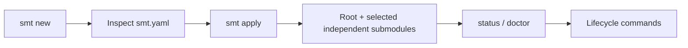

<div align="center">

# SMT

### Sanovy Mono Tool

Safely coordinate a Git root repository with independent submodules through
reviewable blueprints and visible lifecycle operations.

[](https://github.com/parmcoder/smt/blob/main/docs/superpowers/plans/2026-08-17-smt-v0.1.0-production.md)
[](https://github.com/parmcoder/smt/blob/main/go.mod)
[](https://github.com/parmcoder/smt/blob/main/LICENSE)

</div>

> **Development status:** source builds are supported. APIs and generated
> starters remain evolving. SMT does not promise package-manager installation;
> `apply` creates a deterministic, Git-ready scaffold and does not install
> dependencies.

## Why SMT

SMT makes coordination inspectable: review the blueprint, see the root and
each independent repository, and run guarded lifecycle operations with clear
preflight and recovery boundaries. It uses argument-array Git execution,
child-first pushes and pulls, root-first worktree creation, Beads-aware branch
operations, and no credential persistence.

## Available today

| Area | Current capability |
| --- | --- |
| Blueprint | `smt new` creates a reviewed configuration; `smt apply` creates the root and selected independent submodules. |
| Repository lifecycle | `push`, `remote provision`, `pull`, and synchronized `worktree add`. |
| Beads lifecycle | `prepare` and `switch` coordinate existing Beads-ID branches. |
| Diagnostics | `status` and `doctor` report repository, executable, remote, hook, and profile readiness. |
| Hooks | Guarded Lefthook installation and conventional commit validation. |
| Mobile | Current Mobile output is a Git-ready scaffold-only shell, not generated Flutter application source. |

## Getting started from a fresh clone

Prerequisites: Git, Go 1.26.5, Task, and Beads `bd`. Lefthook is optional
until you install hooks. Build and verify SMT first:

```sh
git clone https://github.com/parmcoder/smt.git
cd smt
task verify
task build
./bin/smt --help
mkdir -p ../platform-config
./bin/smt new ../platform-config/smt.yaml
# Inspect and edit ../platform-config/smt.yaml.
./bin/smt apply --config ../platform-config/smt.yaml ../platform
export PATH="$PWD/bin:$PATH"
cd ../platform
smt doctor
```

`smt new` writes a blueprint only after confirmation. Inspect it before
`apply`; the destination must be new. `apply` initializes Beads metadata and
does not install dependencies, call provider APIs, or create remote projects.



## Roadmap

All roadmap items are planned unless marked as available above.

| Horizon | Planned direction |
| --- | --- |
| Now | v1 module/starter restructure around Web, Mobile, API, and Database with a Podman-first runtime. |
| Next | Manifest/toolchain Taskfiles, security, integration/runtime verification, and v0.1.0 human/release gates. |
| Later | `smt extend`, provider-specific CI, observability, managed upgrades, SBOM/signing, and cloud/platform discovery. |

## Safety principles

- Review before apply; preflight all repositories before side effects.
- Use argument arrays; never persist credentials or authorization headers.
- Never force-push, rewrite history, overwrite unmanaged hooks, or silently
  install tools and integrations.
- Report completed and pending work after partial lifecycle failures; do not
  perform destructive automatic rollback.

## Documentation

- [Documentation index](https://github.com/parmcoder/smt/blob/main/docs/README.md)
- [Implementation Spec](https://github.com/parmcoder/smt/blob/main/docs/00-project/SMT%20-%20Implementation%20Spec.md)
- [Product Concept](https://github.com/parmcoder/smt/blob/main/docs/00-project/SMT%20-%20Product%20Concept.md)
- [Command Recipes](https://github.com/parmcoder/smt/blob/main/docs/10-development/SMT%20-%20Command%20Recipes.md)
- [Component Developer Toolchains](https://github.com/parmcoder/smt/blob/main/docs/10-development/SMT%20-%20Component%20Developer%20Toolchains.md)
- [Extensible Modules Design](https://github.com/parmcoder/smt/blob/main/docs/superpowers/specs/2026-08-17-smt-extensible-modules-design.md)
- [v0.1.0 Production Plan](https://github.com/parmcoder/smt/blob/main/docs/superpowers/plans/2026-08-17-smt-v0.1.0-production.md)

## Contributing

Contributions are tracked with Beads. Start with `bd ready`, create or claim a
task before changing files, use the exact task ID as the branch name, and run
`task verify`. Read [AGENTS.md](https://github.com/parmcoder/smt/blob/main/AGENTS.md)
for the repository and agent workflow.

## License

SMT is released under the [MIT License](https://github.com/parmcoder/smt/blob/main/LICENSE).
