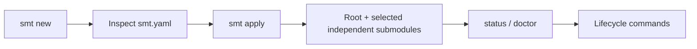

<div align="center">

# SMT

### Sanovy Mono Tool

Safely coordinate a Git root repository with independent submodules through
reviewable blueprints and visible lifecycle operations.

[](https://github.com/parmcoder/smt/blob/main/docs/superpowers/plans/2026-08-17-smt-v0.1.0-production.md)
[](https://github.com/parmcoder/smt/blob/main/go.mod)
[](https://github.com/parmcoder/smt/blob/main/LICENSE)

</div>

> **Development status:** source builds are supported. APIs and generated
> starters remain evolving. `apply` creates a deterministic, Git-ready
> workspace; when Web is selected it runs the pinned local Next.js CLI with
> `--skip-install`, and when Mobile is selected it runs the pinned local Flutter
> CLI with `--no-pub`. Apply then resolves dependencies for selected Web,
> Mobile, and API components in staging before publication. E2E packages,
> browsers, devices, services, and host tooling remain explicit.

## Why SMT

SMT makes coordination inspectable: review the blueprint, see the root and
each independent repository, and run guarded lifecycle operations with clear
preflight and recovery boundaries. It uses argument-array Git execution,
child-first pushes and pulls, root-first worktree creation, Beads-aware branch
operations, and no credential persistence.

## Available today

| Area | Current capability |
| --- | --- |
| Blueprint | `smt new` creates a reviewed configuration; `smt apply` creates the root and selected independent submodules. |
| Repository lifecycle | `push`, `remote provision`, `pull`, and synchronized `worktree add`. |
| Beads lifecycle | `prepare` and `switch` coordinate existing Beads-ID branches. |
| Diagnostics | `status` and `doctor` report repository, executable, remote, hook, and profile readiness. |
| Hooks | Guarded Lefthook installation and conventional commit validation. |
| Web | `.3.2.1` creates a Git-ready Next.js CLI baseline; `.3.2.2/.3` quality and runtime lanes remain deferred. |
| Mobile | Current Mobile output includes a Flutter CLI-generated Android/iOS starter plus stable app, unit, widget, and native integration-test hooks; device/build lanes are reported explicitly when unavailable. |
| E2E | The root `e2e` declaration is being expanded into local Web and Mobile contract-smoke packages by `smt-4xf.14`; no E2E artifacts are generated until that milestone lands. |

## Getting started from a fresh clone

Prerequisites: Git, Go 1.26.5, Task, and Beads `bd`. Lefthook is optional
until you install hooks. Build and verify SMT first:

```sh
git clone https://github.com/parmcoder/smt.git
cd smt
task verify
task build
./bin/smt --help
mkdir -p ../platform-config
./bin/smt new ../platform-config/smt.yaml
# Inspect and edit ../platform-config/smt.yaml.
./bin/smt apply --config ../platform-config/smt.yaml ../platform
export PATH="$PWD/bin:$PATH"
cd ../platform
smt doctor
```

`smt new` writes a blueprint only after confirmation. Inspect it before
`apply`; the destination must be new. `apply` initializes Beads metadata and
bootstraps selected Web, Mobile, and API project dependencies in staging. It
does not call provider APIs or create remote projects. Selected Web and Mobile
applies require their pinned local asdf toolchains; E2E, browser, device,
service, and host-tool setup remains explicit.

## Current Web in-development workflow

The accepted Web path is build-from-source through the local Next.js CLI. After
the root `.tool-versions` file is staged, `smt apply` runs this exact
argument-array command in a temporary Web directory and preserves the CLI
files:

```sh
asdf exec npx --yes create-next-app@16.2.9 <staged-web-directory> --typescript --eslint --app --empty --tailwind --use-pnpm --skip-install --disable-git --agents-md --import-alias=@/*
```

The root pins `nodejs 24.18.0` and `pnpm 11.24.0`. Before applying a Web
blueprint, install the pnpm asdf plugin and pinned version:

```sh
asdf install nodejs 24.18.0
asdf plugin add pnpm
asdf install pnpm 11.24.0
asdf reshim pnpm 11.24.0
```

Apply merges the CLI `.gitignore`, runs `asdf exec pnpm install` in staging,
automatically approves pending pnpm build scripts with
`asdf exec pnpm approve-builds --all` when required, retries the install, and
publishes the Web lockfile, approval policy, and dependencies atomically. The
pinned initializer and dependency setup may access the npm registry. pnpm's
internal relative dependency links are preserved during publication; unsafe,
dangling, absolute, or out-of-tree links fail Apply with source, destination,
target, and reason details. E2E packages, browsers, devices, services, and host
tooling remain explicit.

After Apply, work from `web-app/` with `asdf exec pnpm run dev`. The later
`web_worker` lane owns quality, browser, and runtime checks; this initializer
does not claim that those checks or a real browser/device lane have run. A selected Web Apply also
generates Web-specific `web_worker` routing and skills metadata.

## Current Mobile in-development workflow

The current Mobile path is build-from-source. After the root `.tool-versions`
file is staged, `smt apply` runs this exact command in its staged Mobile
directory and preserves the Flutter CLI output:

```sh
asdf exec flutter --suppress-analytics create --empty --no-pub --platforms=android,ios --org=com.example.smt --project-name=smt_mobile --description="A provider-neutral SMT Flutter mobile starter." <staged-mobile-directory>
```

The root pin is `flutter 3.44.9-stable`. If the pinned toolchain is missing,
Apply fails atomically before the destination is published and reports:

```sh
asdf install flutter 3.44.9-stable
asdf current flutter
```

After a successful Apply, work from `mobile-app/` with `asdf exec flutter pub
get` and `asdf exec flutter analyze`; this later Mobile-worker step produces
and verifies `pubspec.lock` and the pinned `flutter_lints 6.0.0` policy. In the
current checkout, the asdf Flutter create, pub get, and analyze checks pass.
The generated verification lane runs Dart format, Flutter analyze, and unit/widget
tests after `pub get`. The current host has no Android SDK or supported Android/iOS
target, so integration execution and Android/iOS debug builds are explicitly
unverified. Mobile does not require local Compose to launch. The generated
Database child now includes its PostgreSQL Containerfile and readiness
Taskfile; Web runtime assets and root lifecycle orchestration remain later work.

## Planned local E2E workflow

Opt into E2E during `smt new` with the default-no quality declaration. The
current blueprint records `modules: [e2e]` on the root only; the active
`smt-4xf.14` milestone will generate separate `e2e/web` and `e2e/mobile`
packages when Web or Mobile is selected. A declaration without either target
remains valid metadata-only.

The planned first lane is contract smoke, not domain CRUD: Playwright checks
stable Web navigation and `/healthz`; Flutter `integration_test` checks launch
and the `mobile-home`/`api-status` keys. Local E2E tasks will delegate to the
existing component startup commands, preserve failure reports, and report
missing browsers, SDKs, simulators, emulators, or devices explicitly. Apply
will not install npm packages, Playwright browsers, Flutter packages, or host
tooling; those are explicit local setup steps.



## Roadmap

All roadmap items are planned unless marked as available above.

| Horizon | Planned direction |
| --- | --- |
| Now | v1 module/starter restructure around Web, Mobile, API, and Database with a Podman-first runtime. |
| Next | Manifest/toolchain Taskfiles, security, integration/runtime verification, and v0.1.0 human/release gates. |
| Later | `smt extend`, provider-specific CI, observability, managed upgrades, SBOM/signing, and cloud/platform discovery. |

## Safety principles

- Review before apply; preflight all repositories before side effects.
- Use argument arrays; never persist credentials or authorization headers.
- Never force-push, rewrite history, overwrite unmanaged hooks, or silently
  install tools and integrations.
- Report completed and pending work after partial lifecycle failures; do not
  perform destructive automatic rollback.

## Documentation

- [Documentation index](https://github.com/parmcoder/smt/blob/main/docs/README.md)
- [Implementation Spec](https://github.com/parmcoder/smt/blob/main/docs/00-project/SMT%20-%20Implementation%20Spec.md)
- [Product Concept](https://github.com/parmcoder/smt/blob/main/docs/00-project/SMT%20-%20Product%20Concept.md)
- [Command Recipes](https://github.com/parmcoder/smt/blob/main/docs/10-development/SMT%20-%20Command%20Recipes.md)
- [Component Developer Toolchains](https://github.com/parmcoder/smt/blob/main/docs/10-development/SMT%20-%20Component%20Developer%20Toolchains.md)
- [Extensible Modules Design](https://github.com/parmcoder/smt/blob/main/docs/superpowers/specs/2026-08-17-smt-extensible-modules-design.md)
- [v0.1.0 Production Plan](https://github.com/parmcoder/smt/blob/main/docs/superpowers/plans/2026-08-17-smt-v0.1.0-production.md)

## Contributing

Contributions are tracked with Beads. Start with `bd ready`, create or claim a
task before changing files, use the exact task ID as the branch name, and run
`task verify`. Read [AGENTS.md](https://github.com/parmcoder/smt/blob/main/AGENTS.md)
for the repository and agent workflow.

## License

SMT is released under the [MIT License](https://github.com/parmcoder/smt/blob/main/LICENSE).
