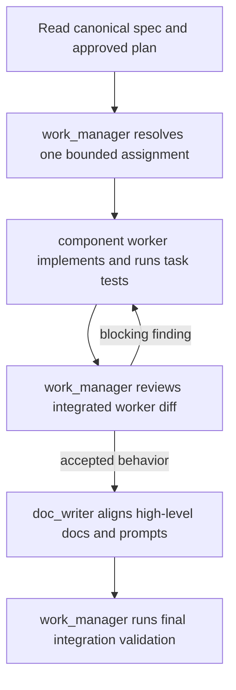

# SMT — Agent Team

## Team shape

The active delivery team uses one Terra/high work manager and Luna worker
contracts for implementation, documentation, and root integration. Every
worker uses GPT-5.6 Luna with the Fast priority tier and extra-high reasoning.
The manager serializes bounded implementation, reviews the integrated result,
and loops only when blocking findings require remediation by the same worker.
This keeps architecture and final quality decisions on the stronger model
without making the manager a component implementer.

The manifests are stored in `agents/` for this checkout. A host integration
can copy or register them in its native agent directory if required.

| Agent | Model | Owns | Must not own |
| --- | --- | --- | --- |
| `work_manager` | `gpt-5.6-terra`, high | Serial delivery assignments, safety decisions, worker review loop, final acceptance | Go/Flutter implementation, delegation beyond the three listed workers |
| `backend_worker` | `gpt-5.6-luna`, Fast, xhigh | Go production code and focused tests assigned by `work_manager` under `internal/` and `cmd/smt/` | Architecture decisions, docs, further delegation, non-manager assignments |
| `mobile_worker` | `gpt-5.6-luna`, Fast, xhigh | Only assigned Flutter/Dart production code and focused tests; explicit SDK/device lane reporting | Architecture decisions, docs, further delegation, Go assignments |
| `doc_writer` | `gpt-5.6-luna`, Fast, xhigh | `docs/`, `prompts/`, durable decisions, handoffs, Mermaid | Go implementation and behavior changes |
| `integration_worker` | `gpt-5.6-luna`, Fast, xhigh | Root gitlinks and integration artifacts in prepared workspaces | Child implementation, Beads claims, agent launch, provider remotes |
| `backend_agent` | `gpt-5.6-terra`, high | Direct, explicitly requested architecture review outside a work-manager delivery | A concurrent work-manager delivery or `backend_worker` assignment |

`integration_worker` is a generated, host-neutral root-integration contract for
prepared workspaces. It owns only root gitlink and integration artifacts; it is
not a downstream implementation delegate. The active implementation topologies
are `work_manager -> backend_worker -> doc_writer` for Go and
`work_manager -> mobile_worker -> doc_writer` for Mobile. The backend route
remains unchanged; `doc_writer` aligns docs only after accepted behavior.
The integration contract makes the root ownership boundary and feature-ID
commit rule explicit for whichever host performs the integration step.

`work_manager` and `backend_agent` use `$godex:godex-go-backend` for Go
architecture and review. `backend_worker` uses it for its assigned
implementation. The documentation worker uses `$codex-obsidian-writer` and
`$codex-obsidian-markdown`.

## Execution flow



## Accepted Mobile Apply boundary

The Mobile lane is implemented through the staged Flutter CLI workflow. The
`.3.5.1` contract owns the Flutter base-manifest policy: Apply creates the
Flutter CLI `pubspec.yaml`, `analysis_options.yaml`, and project baseline; the
`pubspec.lock` and pinned `flutter_lints 6.0.0` policy are produced and
verified later by `mobile_worker` after `asdf exec flutter pub get`. For
`.3.5.2`, after staging the root `.tool-versions` pin
`flutter 3.44.9-stable`, Mobile Apply runs and preserves this exact command in
the staged child:

```sh
asdf exec flutter --suppress-analytics create --empty --no-pub --platforms=android,ios --org=com.example.smt --project-name=smt_mobile --description="A provider-neutral SMT Flutter mobile starter." <staged-mobile-directory>
```

There are no static Android/iOS templates and no Go post-create writes for app
source, tests, or analysis. Apply does not run pub-get or package resolution;
missing Flutter is an atomic failure with `asdf install flutter 3.44.9-stable`
and `asdf current flutter` guidance. `mobile_worker` owns only assigned
Flutter/Dart code and focused tests, reports Android/iOS SDK or device
availability explicitly, and does not claim `.3.5.3` runtime verification.
Current evidence is asdf Flutter create, pub get, and analyze passing; Android
SDK absence, incomplete Xcode, and missing CocoaPods leave device/build lanes
unverified.

## Beads ticket ownership

Agents create feature and task tickets directly with Beads before editing
code. Use `bd prime`, `bd create`, `bd show`, `bd update --claim`, `bd ready`,
`bd blocked`, and `bd close`; Beads is the source of truth for durable work
state. SMT no longer wraps ticket creation, review queues, ready-work listing,
or release readiness. `smt prepare` may still create its special internal
`Prepared workspace` task for repository lifecycle coordination.

## Delegation contract

Every `work_manager` implementation assignment must contain:

- owned paths and explicit non-owned paths;
- dependencies and decisions already resolved;
- acceptance criteria and the narrowest useful checks;
- a requirement to preserve unrelated user changes;
- the expected handoff format: changed paths, checks/results, assumptions,
  unresolved risks, and unverified behavior.

`work_manager` is the worker's sole implementation-assignment issuer. Each
worker implements only its assigned component code and focused tests, does not
spawn agents or silently change the design, and returns implementation/test
evidence to `work_manager`. Component workers report unavailable SDK, device,
Android, or iOS lanes explicitly rather than silently skipping them. Overlapping
writes are serialized by the manager.
The manager reports blocking findings to the same worker rather than taking
over implementation.

## Review gates

1. `work_manager` publishes one decision-complete worker assignment.
2. The assigned component worker verifies its package with focused tests.
3. `work_manager` reviews the integrated diff and routes blocking remediation
   through the same worker.
4. `doc_writer` confirms the accepted contract and prompt agree without
   implementing Go behavior.
5. `work_manager` owns final validation and confirms token hygiene, dry-run
   immutability, commit ordering, and recovery reporting.

## Work-manager boundary

`work_manager` never writes Go or Flutter code, tests, or shared CLI wiring. It may make
delivery decisions, assign exact file boundaries, inspect diffs, and request
remediation. `backend_worker` is the sole owner of assigned Go code;
`mobile_worker` is the sole owner of assigned Flutter/Dart code and focused
tests. Each active worker contract accepts only `work_manager` assignments,
does not delegate further, and returns focused test evidence plus explicit
unavailable-lane results. `work_manager` reviews the integrated worker diff
and routes every blocking finding back to that same worker; it never takes over
implementation.

`backend_agent` is retained for direct architecture work requested outside the
active work-manager path. It is never a downstream delegate of `work_manager`
and does not assign implementation workers.

## Related

- [[SMT - Implementation Spec]]
- [[../10-development/SMT - Component Developer Toolchains|Component Developer Toolchains]]
- [[../../AGENTS|Repository agent operating agreement]]
