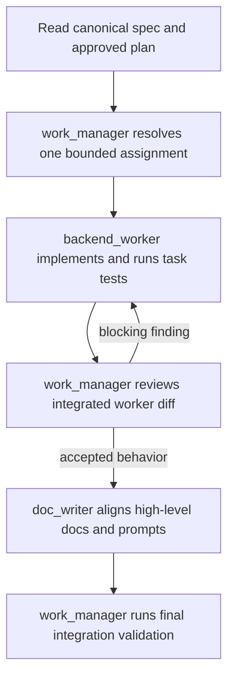

# SMT — Agent Team

## Team shape

The active delivery team uses one Terra/high work manager, one Luna/medium Go
implementation worker, and one Luna/low Obsidian-focused documentation worker.
The manager serializes bounded implementation, reviews the integrated result,
and loops only when blocking findings require remediation by the same worker.
This keeps architecture and final quality decisions on the stronger model
without making the manager a Go implementer.

The manifests are stored in `agents/` for this checkout. A host integration
can copy or register them in its native agent directory if required.

| Agent | Model | Owns | Must not own |
| --- | --- | --- | --- |
| `work_manager` | `gpt-5.6-terra`, high | Serial delivery assignments, safety decisions, worker review loop, final acceptance | Go implementation, delegation beyond the two listed workers |
| `backend_worker` | `gpt-5.6-luna`, medium | Go production code and focused tests assigned by `work_manager` under `internal/` and `cmd/smt/` | Architecture decisions, docs, further delegation, non-manager assignments |
| `doc_writer` | `gpt-5.6-luna`, low | `docs/`, `prompts/`, durable decisions, handoffs, Mermaid | Go implementation and behavior changes |
| `backend_agent` | `gpt-5.6-terra`, high | Direct, explicitly requested architecture review outside a work-manager delivery | A concurrent work-manager delivery or `backend_worker` assignment |

`integration_worker` is a generated, host-neutral root-integration contract for
prepared workspaces. It owns only root gitlink and integration artifacts; it is
not a third downstream delegate. The active work-manager topology remains
`work_manager -> backend_worker` plus the coordinated documentation worker.
The integration contract makes the root ownership boundary and feature-ID
commit rule explicit for whichever host performs the integration step.

`work_manager` and `backend_agent` use `$godex:godex-go-backend` for Go
architecture and review. `backend_worker` uses it for its assigned
implementation. The documentation worker uses `$codex-obsidian-writer` and
`$codex-obsidian-markdown`.

## Execution flow

## Delegation contract

The `work_manager` to `backend_worker` assignment must contain:

- owned paths and explicit non-owned paths;
- dependencies and decisions already resolved;
- acceptance criteria and the narrowest useful checks;
- a requirement to preserve unrelated user changes;
- the expected handoff format: changed paths, checks/results, assumptions,
  unresolved risks, and unverified behavior.

`work_manager` is the worker's sole implementation-assignment issuer. The
worker implements only the assigned Go production code and focused tests under
`internal/` and `cmd/smt/`, does not spawn agents or silently change the
design, and returns implementation/test evidence to `work_manager`. The
manager coordinates exactly `backend_worker` and `doc_writer`; neither worker
delegates further. Overlapping writes are serialized by the manager. The
manager reports blocking findings to the same worker rather than taking over
implementation.

## Review gates

1. `work_manager` publishes one decision-complete worker assignment.
2. `backend_worker` verifies the assigned package with focused tests.
3. `work_manager` reviews the integrated diff and routes blocking remediation
   through the same worker.
4. `doc_writer` confirms the accepted contract and prompt agree without
   implementing Go behavior.
5. `work_manager` owns final validation and confirms token hygiene, dry-run
   immutability, commit ordering, and recovery reporting.

## Work-manager boundary

`work_manager` never writes Go code, tests, or shared CLI wiring. It may make
delivery decisions, assign exact file boundaries, inspect diffs, and request
remediation. `backend_worker` is the sole owner of assigned Go code. The
active worker contract accepts only `work_manager` assignments and covers
manager-assigned Go production code and focused tests under `internal/` and
`cmd/smt/`. `work_manager` reviews the integrated worker diff and routes every
blocking finding back to that same worker; it never takes over implementation.

`backend_agent` is retained for direct architecture work requested outside the
active work-manager path. It is never a downstream delegate of
`work_manager` and does not assign `backend_worker`, so the manager coordinates
exactly the two workers above.

## Related

- [[SMT - Implementation Spec]]
- [[../../AGENTS|Repository agent operating agreement]]
