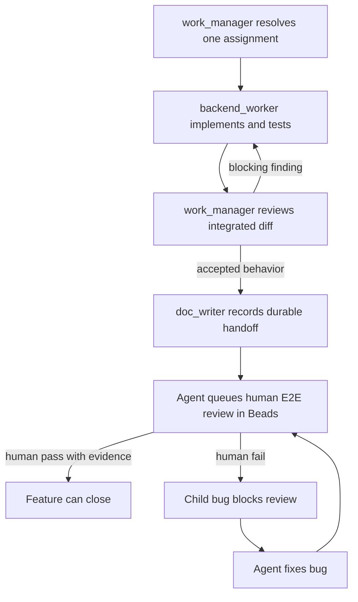

# SMT — Agent Team

## Team shape

The active delivery team has one Terra/high `work_manager`, one Luna/medium
`backend_worker`, and one Luna/low Obsidian-focused `doc_writer`. The manager
coordinates exactly those two downstream workers. It serializes one
decision-complete Go assignment at a time, reviews its integrated result, and
returns blocking implementation findings only to that same worker.

| Agent | Owns | Must not own |
| --- | --- | --- |
| `work_manager` | Delivery decisions, serial backend assignments, integrated review, final acceptance | Go implementation, delegation beyond the two workers, human-review approval |
| `backend_worker` | Manager-assigned Go production code and focused tests under `internal/` and `cmd/smt/` | Architecture decisions, docs, further delegation, review approval |
| `doc_writer` | `docs/`, `prompts/`, durable workflow evidence, and Mermaid diagrams after accepted behavior | Go behavior, Beads issue state, review approval |
| `backend_agent` | Direct, explicitly requested Go architecture/review outside this delivery path | Concurrent work-manager delivery or `backend_worker` assignments |

`work_manager`, `backend_agent`, and `backend_worker` use
`$godex:godex-go-backend` for Go work at their permitted boundary. The
documentation worker uses the installed Codex Obsidian skills. No worker
delegates further.

## Delivery and review flow

The backend handoff names changed paths, checks and results, assumptions,
unresolved risks, unverified behavior, and human E2E steps. `doc_writer`
aligns documentation only after `work_manager` accepts behavior; it does not
change Go behavior or issue state.

## Human review gate

After accepted implementation, the feature stays open while its child
`human-review,e2e` item is queued. A human, not an agent, records pass evidence
and closes that review. A failed review requires title, reproduction, expected
and actual behavior, and evidence; it creates a child bug linked as
`discovered-from` and blocks the review. Closing that bug re-queues the same
review for human retest. Related ready work may continue, but release readiness
is blocked by all open human reviews and related bugs.

Agents must never approve or close human-owned reviews.

## Work-manager boundary

Every assignment names owned and non-owned paths, resolved decisions,
acceptance criteria, the narrowest useful checks, and the required handoff.
The manager preserves unrelated changes, reviews for token hygiene, dry-run
immutability, child-before-root push ordering, redaction, and recovery
reporting. It never implements worker-owned Go code or takes over a blocking
fix.

## Related

- [[SMT - Implementation Spec]]
- [[../../AGENTS|Repository operating agreement]]
