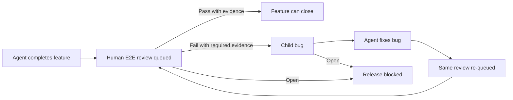

# SMT — Sanovy Mono Tool

## Summary

SMT is a Go program for safe, human-reviewable work across a Git root and its
independent submodules. This document is the source of truth for the next
release. It supersedes earlier linked-worktree and system-Git execution
contracts.

In a TTY, running `smt` starts a Bubble Tea v2.0.8 full-screen application in
the alternate screen. Its top-level workflows are **Setup**, **Work**,
**Human Review**, and **Workspace Health**. Models own UI state; asynchronous
operations run as Bubble Tea commands and return results to the model update
loop. `NO_COLOR`, cancellation, terminal resize, keyboard navigation, and
accessible rendering are supported. No-argument execution outside a TTY does
not emit terminal control sequences: it exits with concise guidance to use an
explicit subcommand.

Explicit subcommands remain the deterministic, plain-output interface for
agents, scripts, and JSON consumers. `smt init [PATH]` opens Setup when
interactive. Existing explicit headless command contracts and exit codes stay
stable except that `smt worktree add` is removed.

Compiled SMT uses [go-git](https://github.com/go-git/go-git) v5.19.2 as its
only Git runtime. It must not invoke a system `git` executable. The library
provides pure-Go repository operations; SMT still preserves its own safety
rules for preflight, credentials, ordering, and error reporting.

Configuration is committed in `smt.yaml`, remains at `version: 1`, and never
contains credentials, authorization headers, or tokens.

## Workspace configuration

Existing valid version-1 workspaces remain readable. SMT does not migrate
them automatically. New workspaces include the optional workflow contract:

```yaml
version: 1
workspace:
  ai_assist: codex
  stack:
    web: nextjs
    api: go
    database: postgresql
    devops: [docker, opentofu]

workflow:
  issue_tracker: beads
  docs_path: docs
  review_policy: release-gate
  required_plugins:
    - source: parmcoder/codex-obsidian
      selector: codex-obsidian@codex-obsidian
    - source: parmcoder/godex
      selector: godex@godex
```

`issue_tracker` is `beads`, `docs_path` is `docs`, and `review_policy` is
`release-gate`. The two plugin source/selector pairs are required for new
Codex-assisted workspaces. They are identifiers for prerequisite verification,
not credentials or installer commands.

The fixed stack values remain `nextjs`, `go`, `postgresql`, and `docker` plus
`opentofu`. New scaffolds write `.tool-versions` with these release-owned pins:

| Selected scope | asdf runtime pins |
| --- | --- |
| Every workspace | `task 3.52.0`, `lefthook 2.1.10` |
| Go API | `golang 1.26.5` |
| Next.js web application | `nodejs 24.18.0` |
| Docker/OpenTofu DevOps | `opentofu 1.12.3` |

Pins are intentionally not selected dynamically at initialization. A later
SMT release changes them through the normal release process.

## Setup and prerequisite gate

Before SMT writes a destination, Setup detects `codex`, `asdf`, and `bd`; it
inspects Codex marketplace/plugin state using machine-readable output and
checks the selected asdf plugins and runtimes. Missing prerequisites produce
official, copyable installation guidance plus a **Re-check** action.

The human runs every global install action. SMT never runs a package manager,
a remote installation script, or a plugin installer on the human's behalf.
Setup verifies the exact Codex Obsidian and Godex selectors above, and asks
the human to start a fresh Codex task after installation so the skills load.

After prerequisites pass, SMT builds the full workspace in a staging
directory. It initializes the Git root and local bootstrap submodules,
initializes Beads with its non-interactive project flow while preserving SMT's
agent instructions, writes configuration and collaboration artifacts, then
publishes the requested destination only after every step succeeds. A failure
leaves no partial destination publication.

## Generated collaboration workspace

New workspaces contain an Obsidian-compatible `docs/` workspace for humans and
agents:

- `docs/README.md` with workflow and review-queue orientation;
- project, decision, feature, and review folders;
- review and bug-report templates that require evidence;
- `docs/Review Queue.base`, a view of review-note metadata rather than a
  second issue tracker;
- generated agent instructions and build prompts routing Go work through
  `$godex:godex-go-backend` and durable documentation through the installed
  Codex Obsidian skills.

Beads is the canonical source of issue state. Markdown notes preserve human
instructions and durable review evidence; the Base only displays that evidence.

## Human E2E review release gate

Every completed feature enters a human-owned E2E review queue. The agent
records changed paths, checks and results, assumptions, unresolved risks,
unverified behavior, and executable review instructions; then it creates a
child `human-review,e2e` review item and makes the feature depend on it.

On pass, a human records reviewer evidence, closes the review, and allows the
unblocked feature to close. On fail, a human supplies a title, reproduction,
expected and actual behavior, and evidence. SMT creates a child bug linked as
`discovered-from`; that bug blocks the review. Once the bug is closed, the
same review returns to the human queue for retest. Agents may continue work
that is otherwise ready, but release readiness remains blocked by every open
human review or its related bug. Agents must never approve or close a
human-owned review.



## Git and safety contract

SMT initializes, inspects, commits, follows standard submodule gitlinks, and
pushes through go-git. Push preflight remains complete before any remote push;
children push before the root. A failed push reports successful and pending
repositories, stops remaining work, and never force-pushes, rewrites history,
or rolls back a successful child push.

HTTPS authentication is runtime-only through `SMT_GITHUB_TOKEN` or
`SMT_GITLAB_TOKEN`; SSH requires an SSH agent and verified `known_hosts`.
Credentials must never be written to configuration, documentation, logs, or
errors. Remote URLs remain credential-free and may be configured after init.
The `doctor` Git-executable prerequisite is removed.

## Verification requirements

Tests cover TUI model navigation, resize, cancellation, prerequisite re-check,
pass/fail forms, recovery rendering, and deterministic views without a real
terminal. Adapter tests use fake `asdf`, `bd`, and `codex` responses and prove
SMT does not execute displayed installer commands. Git tests cover clean,
dirty, and detached state; commits; normal submodule gitlinks; authentication
selection; child-before-root push; partial failure reporting; and redaction.
Scaffold tests prove conditional pins, workflow configuration, generated docs,
staging cleanup, and no partial publication. Review tests cover pass,
fail-to-bug, fix-to-retest, and release gating.

The final acceptance lane runs the full TTY workflow on macOS and Linux and
uses a runtime path without system Git. It also requires human E2E acceptance
of the complete feature-to-review-to-bug-to-retest loop.

## Out of scope

This release does not automatically install prerequisites, migrate existing
workspaces, create provider PRs/MRs, deploy, execute human E2E tests, or
dynamically choose asdf versions. It removes linked-worktree creation rather
than replacing it with another worktree feature.

## Related

- [[SMT - Product Concept]] — compact product framing.
- [[SMT - Agent Team]] — delivery ownership and review queue gate.
- [[../../AGENTS|Repository operating agreement]].
