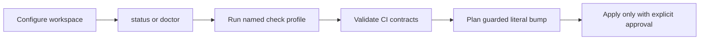

# SMT — Product Concept

SMT gives Sanovy developers and Codex agents one inspectable tool for a root
Git repository with independent submodules. The first useful slice answers
“is this workspace ready?” and “what will this check or contract change do?”
without hiding Git state or silently modifying files.

Its local workflow is:

Safety is the product: argument-array execution, explicit worktree mutation
permission, error severity by default, plan-only changes, path containment,
and no credential persistence. Checkout, submit, provider calls, release
automation, cloud/database actions, and YAML rewrites are planned extensions,
not current capabilities.

## Related

- [[SMT - Implementation Spec]] — canonical behavior and boundaries.
- [[SMT - Agent Team]] — ownership and documentation workflow.
- [[../../AGENTS|Repository operating agreement]].
