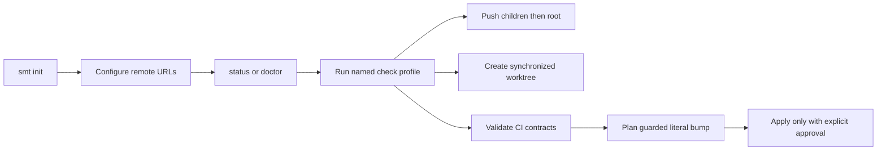

# SMT — Product Concept

SMT gives Sanovy developers and Codex agents one inspectable tool for a root
Git repository with independent submodules. It can now create a local platform
workspace and safely coordinate its normal Git lifecycle without hiding state.

Its local workflow is:

Safety is the product: argument-array execution, complete preflight before
push/worktree side effects, child-first pushes, root-first worktree creation,
path containment, harmless OS metadata filtering, and no credential
persistence. The current CLI covers initialization, inspection, checks,
contracts, CI audits, guarded contract bumps, configured pushes, and linked
worktrees. The release path is deliberately split: `release:build` makes four
local archives and checksums, while a clean `release:tag` creates and pushes an
annotated version tag. GitHub Actions now publishes a GitHub Release from that
tag with the four archives and checksum file.

Direct provider-native release CLI orchestration does not exist, and GitLab
release automation does not exist. Remote repository creation, external-clone
submodule URL synchronization, submit orchestration, cloud or database actions,
deployment, rollback, and credential storage remain outside the current product
boundary.

## Related

- [[SMT - Implementation Spec]] — canonical behavior and boundaries.
- [[../10-development/SMT - Command Recipes]] — runnable examples.
- [[SMT - Agent Team]] — ownership and documentation workflow.
- [[../../AGENTS|Repository operating agreement]].
