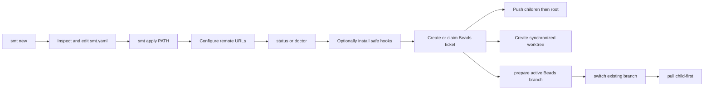

# SMT — Product Concept

SMT gives Sanovy developers and Codex agents one inspectable tool for a root
Git repository with independent submodules. It creates a reviewable blueprint
before applying a local platform workspace, then safely coordinates its normal
Git lifecycle without hiding state.

Generated blueprints carry the exact deterministic provenance contract described
in [[SMT - Implementation Spec#Configuration contract|the implementation
specification]]. Provenance contains only the SMT tool/version and template-set
version: no timestamp, user, machine or path, Git SHA, random value, or
environment-derived field.

Its local workflow is:



Safety is the product: argument-array execution, an explicit blueprint review
before workspace creation, complete preflight before push/worktree side
effects, child-first pushes, root-first worktree creation, path containment,
harmless OS metadata filtering, no credential persistence, and no automatic
hook overwrite. A workspace hook install is all-repository-preflighted, then
root-first; it never forces, overwrites an unmanaged hook, or rolls back an
earlier install. The current CLI covers blueprint creation and application,
inspection, safe hook installation, configured pushes, linked worktrees,
Beads-branch preparation/switching, child-first pulls, and status/doctor
diagnostics. Agents create and claim work directly in Beads; SMT does not
provide ticket, review-queue, or release-readiness wrappers. The release path
is deliberately split: `release:build` makes four
local archives and checksums, while a clean `release:tag` creates and pushes an
annotated version tag. GitHub Actions now publishes a GitHub Release from that
tag with the four archives and checksum file.

Direct provider-native release CLI orchestration does not exist, and GitLab
release automation does not exist. Remote repository creation, external-clone
submodule URL synchronization, workspace submit orchestration, Jira aliases,
assignment waves, provider review automation, cloud or database actions,
deployment, rollback, and credential storage remain outside the current product
boundary.

Human `status` and `doctor` reports emphasize the next safe action. `doctor`
defaults to action-first output and offers `--tree` plus safe `--verbose` detail.
`status
--json` is intentionally separate for automation. Both may say that a
`commit-msg` hook is absent, current, or unmanaged; an unmanaged hook is a
human decision, never something SMT replaces. Generated `lefthook.yml` is a
scaffold, not proof that Lefthook has run or that a hook was installed.

## Module taxonomy and deferred runtime

The implemented version-1 module taxonomy uses the five-layer vocabulary
`control-plane`, `application-components`, `shared-infrastructure`,
`quality-verification`, and `platform-delivery`, while keeping the layers in
this repository initially. The static schema-v1 catalog is code-owned rather
than user YAML and contains exactly 11 declarations: selectable `web`,
`mobile`, `api`, `database`, and `e2e`, plus non-selectable platform
declarations `container`, `cicd`, `observability`, `iac`, `k8s`, and `argocd`.

Placement is declarative. The validated mode vocabulary is `attached`, `shared`,
and `independent`; the built-in `.5` declarations use `attached` or
`independent` and reserve `shared` for a later declaration. The authoritative
placement and completion matrix is:

| Modules | Mode and targets | Stable completion IDs |
| --- | --- | --- |
| `web`, `mobile`, `api`, `database` | independent self-targets (`web`, `mobile`, `api`, `database`) | `web.declaration`, `mobile.declaration`, `api.declaration`, `database.declaration` |
| `e2e` | attached to `repo` | `e2e.declaration` |
| `container` | attached to `web` + `api` | `container.declaration` |
| `cicd` | attached to `repo` + `web` + `mobile` + `api` + `database` | `cicd.repository-boundary` |
| `observability` | attached to `web` + `api` + `database` | `observability.boundary` |
| `iac` | independent at `platform/iac` | `iac.provider-neutral` |
| `k8s` | independent at `platform/k8s` | `k8s.static-validation` |
| `argocd` | independent at `platform/argocd`; requires `k8s` | `argocd.sync-policy` |

The full declarations, including scopes, categories/layers, and exact target
arrays, are canonical in [[SMT - Implementation Spec#Implemented `.5` module declaration contract|the implementation specification]].
Catalog validation covers schema, duplicate and unknown references, safe paths,
placement, capabilities, stable completion IDs, and dependency cycles.
Configuration validation covers repository module IDs and required
capabilities. `Config.LoadBytes` accepts known platform metadata when its
references and dependencies are valid, including non-selectable declarations,
but `Apply` and `ValidateBlueprint` reject non-selectable platform metadata
before topology or staging/destination mutation.

The accepted version-1 taxonomy/configuration change is implemented: new
blueprints select independent Web, optional Mobile, API, and Database
components in deterministic `repo`, `web`, `mobile`, `api`, `database` order,
with omitted selections absent and the Mobile question immediately after Web;
they have no DevOps prompt, `workspace.stack.devops`, combined `infra`
repository, or Docker/OpenTofu component/tooling metadata or generated DevOps
artifacts. Legacy DevOps-shaped configurations are rejected before `smt apply`
mutates the destination, with a migration-oriented removal/regeneration error.

Repositories may carry optional `modules: [id...]` metadata, and configurations
without that field remain valid. Component repositories receive exact catalog
IDs. After the existing Web/Mobile/API/Database questions, `smt new` offers a
default-no quality-root declaration; opting in records only `modules: [e2e]` on
the root blueprint. Current Apply remains metadata-only for E2E. The P0
`smt-4xf.14` rollup will generate separate attached `e2e/web` and `e2e/mobile`
packages when Web or Mobile is selected; without either target, the
declaration remains valid and emits no runnable package. The Web package uses
Playwright and the Mobile package uses Flutter's native `integration_test`.
The first lane is contract smoke only (stable navigation hooks, Web
`/healthz`, optional API reachability, and Mobile `mobile-home`/`api-status`),
with local orchestration through existing component tasks. Apply will not
install packages, browsers, SDKs, devices, credentials, or remote CI. The
catalog and its verification/scaffold fields remain declarations until this
rollup is implemented; the `.5` platform/runtime boundaries and deferred
`smt extend` remain unchanged.

The implemented `.3.1` slice adds a deterministic root runtime contract:
`smt apply` writes `compose.yaml` and `.env.example`, and root `.gitignore`
ignores `.env`. Compose contains only selected `web`, `api`, and `database`
services; Mobile remains outside OCI Compose. API-only, Database-only, Web-only,
API+Database, all-OCI, empty, and Mobile-only selections remain valid. Default
bindings are Web `3000:3000`, API `8080:8080`, and Database `5432:5432`, with
`WEB_PORT`, `API_PORT`, and `DATABASE_PORT` overrides. When an override is
unset, the generated `.env.example` derives a deterministic workspace-scoped
host port so fresh workspaces can run in parallel. The project name is the
safe lowercase-hyphen destination basename capped at 63 characters, falling
back to `smt-workspace`; generated local resource names use that project as
`<project>-postgres-data`, `<project>-zitadel`, and
`<project>-zitadel-bootstrap`.

Web probes `/healthz`; API health/readiness are `/healthz` and `/readyz`; and
Database health uses `pg_isready`. Web depends conditionally on a healthy API,
and API depends conditionally on a healthy Database. `.env.example` contains
examples only with the generated local resource names and the
`DATABASE_PASSWORD=smt-dev-password` value; replace it outside disposable
local use. No `.env` file is generated. The pure preflight API reports invalid or occupied ports
and missing Podman/Podman Compose prerequisites through injectable checks, but
the static root Apply path remains offline and does not invoke Preflight,
Podman, Compose, socket probing, or health checks. Selected Web Apply is the
documented pinned `npx` registry-access exception.

Mobile-selected Apply stages the child and root `.tool-versions` with
`flutter 3.44.9-stable`, then runs the exact Flutter-owned project creation
command for `.3.5.2`:

```sh
asdf exec flutter --suppress-analytics create --empty --no-pub --platforms=android,ios --org=com.example.smt --project-name=smt_mobile --description="A provider-neutral SMT Flutter mobile starter." <staged-mobile-directory>
```

The `.3.5.1` base-manifest policy remains Flutter-owned: Apply creates the
Flutter CLI `pubspec.yaml`, `analysis_options.yaml`, and project baseline; the
`pubspec.lock` and pinned `flutter_lints 6.0.0` policy are produced and
verified later by `mobile_worker` after `asdf exec flutter pub get`. Apply uses
`--no-pub`, so it emits no lockfile and performs no package resolution. Apply
preserves the CLI platform output; the Mobile verification worker then adds
the stable app, optional API config, unit/widget tests, native integration
test, and SDK dependency declaration. It does not use static Android/iOS
templates. `--no-pub` keeps Apply offline and package-resolution-free. If the
pinned toolchain is unavailable,
Apply fails atomically with `asdf install flutter 3.44.9-stable` and `asdf
current flutter` guidance. The generated README then guides `asdf exec
flutter pub get`, analysis, and Android Studio/emulator or full Xcode/iPhone
setup. Current `.3.5.3` evidence passes Dart format, pub get, Flutter analyze,
and unit/widget tests; the host has no Android SDK or supported Android/iOS
target, so integration execution and debug builds are explicitly unverified.
Mobile remains outside OCI Compose, and the current `.3.1`
Compose file is a declarative contract without component Containerfiles, so
Compose is not required to launch the starter locally.

### Implemented Web CLI initializer

Web `.3.2.1` is implemented as a CLI-owned Next.js baseline: the root pins
`nodejs 24.18.0`, and selected Web Apply stages and invokes this exact
argument-array command:

```sh
asdf exec npx --yes create-next-app@16.2.9 <staged-web-directory> --typescript --eslint --app --empty --tailwind --use-npm --skip-install --disable-git --agents-md --import-alias=@/*
```

The CLI owns the generated `package.json`, App Router, Tailwind, `AGENTS.md`,
and related baseline files. Apply preserves that output, merges the CLI
`.gitignore`, publishes no `package-lock.json`, and performs no `npm install` or
dependency resolution. Staging is atomic: a failed initializer leaves the
destination unpublished and reports `asdf install nodejs 24.18.0`,
`asdf current nodejs`, and the pinned CLI `--help` recovery path. Apply also
generates Web-specific `web_worker` routing and skills metadata.

The pinned `npx create-next-app` call is the sole Apply exception that may
access the npm registry. Non-Web and static Apply paths remain offline; Web
still performs no installation, lockfile publication, or dependency
resolution.

After Apply, the local Web workflow is `asdf exec npm install` followed by
`asdf exec npm run dev` from `web-app/`. The later `.3.2.2/.3` Web worker lanes
own npm lockfile creation, quality, browser, and runtime checks; `.3.2.1`
does not claim real npm or runtime evidence. Future Web build contexts and
Containerfiles, Database lifecycle tasks, broader Mobile API integration,
platform runtime work, a remote module registry, and `smt extend` remain
deferred. Database `.3.4.1` now provides its independent PostgreSQL runtime
and readiness assets; `.3.1` adds no app-domain behavior.

The implemented `.3.3.1` API manifest slice adds static `go.mod` and `go.sum`
only to selected API child repositories. They use module
`example.com/smt/apis` and `go 1.26.5`; Huma v2.39.1 is always present for
API, while pgx v5.10.0 and golang-migrate v4.19.1 appear only for
API+Database; that selection also pins `github.com/lib/pq v1.10.9` for the
PostgreSQL-tagged migration tool. Tool directives pin govulncheck with `golang.org/x/vuln v1.7.0`,
golangci-lint v2 with `github.com/golangci/golangci-lint/v2 v2.12.2`, and the
migrate tool only for API+Database. API-only excludes pgx/migrate, and no API
selection emits no API manifests. Direct pinned sums are committed; full
transitive closure remains outside the manifest slice.

Apply writes these static files without invoking Go, `go mod`, a package
manager, the network, or tool installation. SDK/editor/agent tools are not
module dependencies. `go mod tidy` remains a later source-closure check;
`go mod verify` is exercised only through the generated child `mod` task.

The implemented `.3.3.2` API runtime slice emits deterministic API-selected
`main.go`, `internal/server/server.go`, `cmd/openapi/main.go`, `.env.example`,
`openapi.yaml`, and `Taskfile.yml` assets in addition to the `.3.3.1` manifests. No API
selection emits no API child or API assets. The module remains
`example.com/smt/apis` on Go `1.26.5`, using Huma v2.39.1 through the Gin
adapter, Gin v1.12.0, and Prometheus `github.com/prometheus/client_golang v1.24.1`. API-only source
has no pgx, migrate, or database code; API+Database keeps pgx/migrate manifest
dependencies only.

The generated runtime uses JSON `slog` and defaults
`HTTP_ADDR=:8080`, `APP_ENV=development`, `LOG_LEVEL=info`,
`HTTP_READ_TIMEOUT=15s`, `HTTP_READ_HEADER_TIMEOUT=5s`,
`HTTP_WRITE_TIMEOUT=15s`, `HTTP_IDLE_TIMEOUT=60s`,
`HTTP_MAX_HEADER_BYTES=1048576`, and `HTTP_SHUTDOWN_TIMEOUT=10s`. Huma emits
OpenAPI 3.1 metadata title `SMT API`, version `v0.1.0`, and `/docs`,
`/openapi.json`, and `/openapi.yaml` routes. The offline `cmd/openapi` command
constructs the shared Huma API and writes `api.OpenAPI().YAML()` without a
listener; the committed YAML is byte-identical to regeneration across fresh
Apply destinations.

The generated server `Config` carries direct `github.com/caarlos0/env/v11
v11.4.1` `env`/`envDefault` tags on its typed fields, including `slog.Level`
for `LogLevel` and `time.Duration` for the timeout fields. `LoadConfig()` calls
plain `env.Parse(&cfg)`; native caarlos/TextUnmarshaler parsing controls
malformed-value errors; no separate semantic conversion or post-parse
validation is added. `Run` logs a structured `configuration load failed`
event and panics with the native parse error before constructing the
application. Normal Gin/Huma runtime and graceful-shutdown behavior is
unchanged. The exact pin and direct checksums are present in both static API
manifest variants.

Each API selection also receives a deterministic child `Taskfile.yml` with
top-level `dotenv: ['.env']`; it never copies or mutates `.env`. Tasks are
`build` (trimpath binary `bin/apis`), `run` (built binary), `test`, `coverage`,
`mod` (`go mod verify`), offline byte-comparing `openapi`, and `verify` with
`build`, `test`, `mod`, `openapi`, and `go vet ./...` dependencies. API+Database
receives conditional API-owned `migrate:create`, `migrate:up`, `migrate:version`,
and `migrate:validate` tasks. These use `GOFLAGS=-tags=postgres`, and
`migrate:create` transports `NAME` through a task environment variable before
shell quoting. The API also receives a neutral baseline; database readiness and
live lifecycle tasks belong to `smt-4xf.3.4.3` and later. Task v3.52.0 verified dotenv-driven
`/healthz` behavior and bounded process cleanup in the generated child harness.

`/healthz` returns 200 `ok`; `/readyz` returns 503 `not_ready` before bootstrap
or during shutdown and 200 `ready` after bootstrap. `/metrics` shares the
listener and exposes Go/process plus bounded request metrics. Safe
`X-Request-ID` values are accepted or generated and returned. Gin panic recovery logs panic/stack,
route, method, and request ID through JSON `slog` before returning generic 500;
SIGINT/SIGTERM performs timed graceful shutdown. API-selected Apply writes
embedded assets only and performs no network, Go/package-manager command, tool
installation, Task execution, Podman, listener, or runtime execution. Credentials, domain CRUD, DB
connectivity/readiness, root Taskfile changes, Containerfiles, non-root
packaging, and `smt extend` remain out of scope. Durable unit/race/fuzz/
integration tests are `.3.3.3`; non-root packaging/runtime verification is
`.3.3.4`, with later human and Podman gates still required.

Blueprint and static generation remains byte-stable without network access for
identical selections in fresh destinations. Selected Web `.3.2.1` Apply is the documented
pinned `npx` initializer exception and may access the npm registry without
installing or resolving dependencies. All other Apply paths remain offline.
`smt apply` rejects missing, unsupported, or unknown provenance before mutation
and refuses an existing file or directory without overwrite,
merge, regeneration, upgrade, or `smt extend` execution. A general non-generated
version-1 configuration may still serve lifecycle and diagnostic commands
without provenance, but it is not applyable as a new generated blueprint. See
[[../superpowers/specs/2026-08-17-smt-extensible-modules-design|SMT Extensible Modules Design]] and [[../superpowers/plans/2026-08-17-smt-v0.1.0-production|SMT v0.1.0 Production Plan]]. Beads remains the delivery status source of truth.

## Related

- [[SMT - Implementation Spec]] — canonical behavior and boundaries.
- [[../10-development/SMT - Command Recipes]] — runnable examples.
- [[SMT - Agent Team]] — ownership and documentation workflow.
- [[../../AGENTS|Repository operating agreement]].
