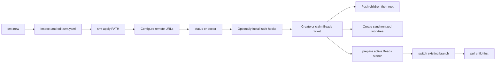

# SMT — Product Concept

SMT gives Sanovy developers and Codex agents one inspectable tool for a root
Git repository with independent submodules. It creates a reviewable blueprint
before applying a local platform workspace, then safely coordinates its normal
Git lifecycle without hiding state.

Generated blueprints carry the exact deterministic provenance contract described
in [[SMT - Implementation Spec#Configuration contract|the implementation
specification]]. Provenance contains only the SMT tool/version and template-set
version: no timestamp, user, machine or path, Git SHA, random value, or
environment-derived field.

Its local workflow is:

Safety is the product: argument-array execution, an explicit blueprint review
before workspace creation, complete preflight before push/worktree side
effects, child-first pushes, root-first worktree creation, path containment,
harmless OS metadata filtering, no credential persistence, and no automatic
hook overwrite. A workspace hook install is all-repository-preflighted, then
root-first; it never forces, overwrites an unmanaged hook, or rolls back an
earlier install. The current CLI covers blueprint creation and application,
inspection, safe hook installation, configured pushes, linked worktrees,
Beads-branch preparation/switching, child-first pulls, and status/doctor
diagnostics. Agents create and claim work directly in Beads; SMT does not
provide ticket, review-queue, or release-readiness wrappers. The release path
is deliberately split: `release:build` makes four
local archives and checksums, while a clean `release:tag` creates and pushes an
annotated version tag. GitHub Actions now publishes a GitHub Release from that
tag with the four archives and checksum file.

Direct provider-native release CLI orchestration does not exist, and GitLab
release automation does not exist. Remote repository creation, external-clone
submodule URL synchronization, workspace submit orchestration, Jira aliases,
assignment waves, provider review automation, cloud or database actions,
deployment, rollback, and credential storage remain outside the current product
boundary.

Human `status` and `doctor` reports emphasize the next safe action. `doctor`
defaults to action-first output and offers `--tree` plus safe `--verbose` detail.
`status
--json` is intentionally separate for automation. Both may say that a
`commit-msg` hook is absent, current, or unmanaged; an unmanaged hook is a
human decision, never something SMT replaces. Generated `lefthook.yml` is a
scaffold, not proof that Lefthook has run or that a hook was installed.

## Module taxonomy and deferred runtime

The implemented version-1 module taxonomy uses the five-layer vocabulary
`control-plane`, `application-components`, `shared-infrastructure`,
`quality-verification`, and `platform-delivery`, while keeping the layers in
this repository initially. The static schema-v1 catalog is code-owned rather
than user YAML. Its built-in selectable entries are exactly Web, Mobile, API,
Database, and the E2E quality declaration; it has no built-in control-plane or
platform entry. Web, Mobile, and API are application components, Database is
shared infrastructure, and E2E is quality verification.

The accepted version-1 taxonomy/configuration change is implemented: new
blueprints select independent Web, optional Mobile, API, and Database
components in deterministic `repo`, `web`, `mobile`, `api`, `database` order,
with omitted selections absent and the Mobile question immediately after Web;
they have no DevOps prompt,
`workspace.stack.devops`, combined `infra` repository, or Docker/OpenTofu
component/tooling metadata or generated DevOps artifacts. Legacy
DevOps-shaped configurations are rejected before `smt apply` mutates the
destination, with a migration-oriented removal/regeneration error.

Repositories may carry optional `modules: [id...]` metadata, and configurations
without that field remain valid. Component repositories receive exact catalog
IDs. After the existing Web/Mobile/API/Database questions, `smt new` offers a
default-no quality-root declaration; opting in records only `modules: [e2e]` on
the root, with no E2E repository, scaffold, or generated artifact. The catalog
also records capabilities, safe placement defaults, agent/skill references, argument-
array verification requirements including mutability, and reviewed
scaffold-asset identity. Catalog and configuration validation cover schema,
duplicates, category/layer pairs, capability references and dependencies,
unsafe paths, and repository module IDs. Apply requires exact generated
annotations and persists them, but does not run verification recipes, install
tools/skills/MCP, mutate host configuration, or create module repositories.

The runnable starter remains planned: Web, API, and PostgreSQL are intended to
be runnable operational skeletons using Podman/Compose, and Mobile is intended
as an Android/iOS starter rather than an OCI workload. This release provides
no runnable templates or Podman/Compose artifacts. Platform artifacts and
capabilities, a remote module registry, and `smt extend` remain deferred.
Generation remains offline and byte-stable
for identical selections in fresh destinations. `smt apply` rejects missing,
unsupported, or unknown provenance before mutation and refuses an existing
file or directory without overwrite, merge, regeneration, upgrade, or
`smt extend` execution. A general non-generated version-1 configuration may
still serve lifecycle and diagnostic commands without provenance, but it is not
applyable as a new generated blueprint. See [[../superpowers/specs/2026-08-17-smt-extensible-modules-design|SMT Extensible Modules Design]] and [[../superpowers/plans/2026-08-17-smt-v0.1.0-production|SMT v0.1.0 Production Plan]]. Beads remains the delivery status source of truth.

## Related

- [[SMT - Implementation Spec]] — canonical behavior and boundaries.
- [[../10-development/SMT - Command Recipes]] — runnable examples.
- [[SMT - Agent Team]] — ownership and documentation workflow.
- [[../../AGENTS|Repository operating agreement]].
