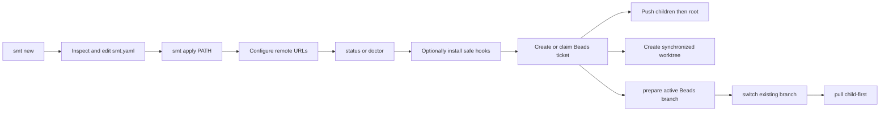

# SMT — Product Concept

SMT gives Sanovy developers and Codex agents one inspectable tool for a root
Git repository with independent submodules. It creates a reviewable blueprint
before applying a local platform workspace, then safely coordinates its normal
Git lifecycle without hiding state.

Generated blueprints carry the exact deterministic provenance contract described
in [[SMT - Implementation Spec#Configuration contract|the implementation
specification]]. Provenance contains only the SMT tool/version and template-set
version: no timestamp, user, machine or path, Git SHA, random value, or
environment-derived field.

Its local workflow is:

Safety is the product: argument-array execution, an explicit blueprint review
before workspace creation, complete preflight before push/worktree side
effects, child-first pushes, root-first worktree creation, path containment,
harmless OS metadata filtering, no credential persistence, and no automatic
hook overwrite. A workspace hook install is all-repository-preflighted, then
root-first; it never forces, overwrites an unmanaged hook, or rolls back an
earlier install. The current CLI covers blueprint creation and application,
inspection, safe hook installation, configured pushes, linked worktrees,
Beads-branch preparation/switching, child-first pulls, and status/doctor
diagnostics. Agents create and claim work directly in Beads; SMT does not
provide ticket, review-queue, or release-readiness wrappers. The release path
is deliberately split: `release:build` makes four
local archives and checksums, while a clean `release:tag` creates and pushes an
annotated version tag. GitHub Actions now publishes a GitHub Release from that
tag with the four archives and checksum file.

Direct provider-native release CLI orchestration does not exist, and GitLab
release automation does not exist. Remote repository creation, external-clone
submodule URL synchronization, workspace submit orchestration, Jira aliases,
assignment waves, provider review automation, cloud or database actions,
deployment, rollback, and credential storage remain outside the current product
boundary.

Human `status` and `doctor` reports emphasize the next safe action. `doctor`
defaults to action-first output and offers `--tree` plus safe `--verbose` detail.
`status
--json` is intentionally separate for automation. Both may say that a
`commit-msg` hook is absent, current, or unmanaged; an unmanaged hook is a
human decision, never something SMT replaces. Generated `lefthook.yml` is a
scaffold, not proof that Lefthook has run or that a hook was installed.

## Module taxonomy and deferred runtime

The implemented version-1 module taxonomy uses the five-layer vocabulary
`control-plane`, `application-components`, `shared-infrastructure`,
`quality-verification`, and `platform-delivery`, while keeping the layers in
this repository initially. The static schema-v1 catalog is code-owned rather
than user YAML and contains exactly 11 declarations: selectable `web`,
`mobile`, `api`, `database`, and `e2e`, plus non-selectable platform
declarations `container`, `cicd`, `observability`, `iac`, `k8s`, and `argocd`.

Placement is declarative. The validated mode vocabulary is `attached`, `shared`,
and `independent`; the built-in `.5` declarations use `attached` or
`independent` and reserve `shared` for a later declaration. The authoritative
placement and completion matrix is:

| Modules | Mode and targets | Stable completion IDs |
| --- | --- | --- |
| `web`, `mobile`, `api`, `database` | independent self-targets (`web`, `mobile`, `api`, `database`) | `web.declaration`, `mobile.declaration`, `api.declaration`, `database.declaration` |
| `e2e` | attached to `repo` | `e2e.declaration` |
| `container` | attached to `web` + `api` | `container.declaration` |
| `cicd` | attached to `repo` + `web` + `mobile` + `api` + `database` | `cicd.repository-boundary` |
| `observability` | attached to `web` + `api` + `database` | `observability.boundary` |
| `iac` | independent at `platform/iac` | `iac.provider-neutral` |
| `k8s` | independent at `platform/k8s` | `k8s.static-validation` |
| `argocd` | independent at `platform/argocd`; requires `k8s` | `argocd.sync-policy` |

The full declarations, including scopes, categories/layers, and exact target
arrays, are canonical in [[SMT - Implementation Spec#Implemented `.5` module declaration contract|the implementation specification]].
Catalog validation covers schema, duplicate and unknown references, safe paths,
placement, capabilities, stable completion IDs, and dependency cycles.
Configuration validation covers repository module IDs and required
capabilities. `Config.LoadBytes` accepts known platform metadata when its
references and dependencies are valid, including non-selectable declarations,
but `Apply` and `ValidateBlueprint` reject non-selectable platform metadata
before topology or staging/destination mutation.

The accepted version-1 taxonomy/configuration change is implemented: new
blueprints select independent Web, optional Mobile, API, and Database
components in deterministic `repo`, `web`, `mobile`, `api`, `database` order,
with omitted selections absent and the Mobile question immediately after Web;
they have no DevOps prompt, `workspace.stack.devops`, combined `infra`
repository, or Docker/OpenTofu component/tooling metadata or generated DevOps
artifacts. Legacy DevOps-shaped configurations are rejected before `smt apply`
mutates the destination, with a migration-oriented removal/regeneration error.

Repositories may carry optional `modules: [id...]` metadata, and configurations
without that field remain valid. Component repositories receive exact catalog
IDs. After the existing Web/Mobile/API/Database questions, `smt new` offers a
default-no quality-root declaration; opting in records only `modules: [e2e]` on
the root, with no E2E repository, scaffold, or generated artifact. The catalog
and its verification/scaffold fields are declarations only. The `.5` slice
does not create platform repositories or platform scaffolds, install tools,
skills, or MCP, mutate host configuration, or run platform runtimes.

The implemented `.3.1` slice adds a deterministic root runtime contract:
`smt apply` writes `compose.yaml` and `.env.example`, and root `.gitignore`
ignores `.env`. Compose contains only selected `web`, `api`, and `database`
services; Mobile remains outside OCI Compose. API-only, Database-only, Web-only,
API+Database, all-OCI, empty, and Mobile-only selections remain valid. Default
bindings are Web `3000:3000`, API `8080:8080`, and Database `5432:5432`, with
`WEB_PORT`, `API_PORT`, and `DATABASE_PORT` overrides. The project name is the
safe lowercase-hyphen destination basename capped at 63 characters, falling
back to `smt-workspace`.

Web probes `/healthz`; API health/readiness are `/healthz` and `/readyz`; and
Database health uses `pg_isready`. Web depends conditionally on a healthy API,
and API depends conditionally on a healthy Database. `.env.example` contains
examples only with an empty `DATABASE_PASSWORD=`; no credentials or `.env`
file is generated. The pure preflight API reports invalid or occupied ports
and missing Podman/Podman Compose prerequisites through injectable checks, but
`smt apply` remains offline and does not invoke Preflight, Podman, Compose,
socket probing, or health checks.

Future Web/Mobile/Database build contexts, Containerfiles, lifecycle tasks,
broader runnable starters, platform runtime work, a remote module registry, and
`smt extend` remain deferred; `.3.1` adds no app-domain behavior.

The implemented `.3.3.1` API manifest slice adds static `go.mod` and `go.sum`
only to selected API child repositories. They use module
`example.com/smt/apis` and `go 1.26.5`; Huma v2.39.1 is always present for
API, while pgx v5.10.0 and golang-migrate v4.19.1 appear only for
API+Database. Tool directives pin govulncheck with `golang.org/x/vuln v1.7.0`,
golangci-lint v2 with `github.com/golangci/golangci-lint/v2 v2.12.2`, and the
migrate tool only for API+Database. API-only excludes pgx/migrate, and no API
selection emits no API manifests. Direct pinned sums are committed; full
transitive closure remains outside the manifest slice.

Apply writes these static files without invoking Go, `go mod`, a package
manager, the network, or tool installation. SDK/editor/agent tools are not
module dependencies. `go mod tidy` remains a later source-closure check;
`go mod verify` is exercised only through the generated child `mod` task.

The implemented `.3.3.2` API runtime slice emits deterministic API-selected
`main.go`, `internal/server/server.go`, `cmd/openapi/main.go`, `.env.example`,
`openapi.yaml`, and `Taskfile.yml` assets in addition to the `.3.3.1` manifests. No API
selection emits no API child or API assets. The module remains
`example.com/smt/apis` on Go `1.26.5`, using Huma v2.39.1 through the Gin
adapter, Gin v1.12.0, and Prometheus `github.com/prometheus/client_golang v1.24.1`. API-only source
has no pgx, migrate, or database code; API+Database keeps pgx/migrate manifest
dependencies only.

The generated runtime uses JSON `slog` and defaults
`HTTP_ADDR=:8080`, `APP_ENV=development`, `LOG_LEVEL=info`,
`HTTP_READ_TIMEOUT=15s`, `HTTP_READ_HEADER_TIMEOUT=5s`,
`HTTP_WRITE_TIMEOUT=15s`, `HTTP_IDLE_TIMEOUT=60s`,
`HTTP_MAX_HEADER_BYTES=1048576`, and `HTTP_SHUTDOWN_TIMEOUT=10s`. Huma emits
OpenAPI 3.1 metadata title `SMT API`, version `v0.1.0`, and `/docs`,
`/openapi.json`, and `/openapi.yaml` routes. The offline `cmd/openapi` command
constructs the shared Huma API and writes `api.OpenAPI().YAML()` without a
listener; the committed YAML is byte-identical to regeneration across fresh
Apply destinations.

The generated server `Config` carries direct `github.com/caarlos0/env/v11
v11.4.1` `env`/`envDefault` tags on its typed fields, including `slog.Level`
for `LogLevel` and `time.Duration` for the timeout fields. `LoadConfig()` calls
plain `env.Parse(&cfg)`; native caarlos/TextUnmarshaler parsing controls
malformed-value errors; no separate semantic conversion or post-parse
validation is added. `Run` logs a structured `configuration load failed`
event and panics with the native parse error before constructing the
application. Normal Gin/Huma runtime and graceful-shutdown behavior is
unchanged. The exact pin and direct checksums are present in both static API
manifest variants.

Each API selection also receives a deterministic child `Taskfile.yml` with
top-level `dotenv: ['.env']`; it never copies or mutates `.env`. Tasks are
`build` (trimpath binary `bin/apis`), `run` (built binary), `test`, `coverage`,
`mod` (`go mod verify`), offline byte-comparing `openapi`, and `verify` with
`build`, `test`, `mod`, `openapi`, and `go vet ./...` dependencies. API+Database
receives the same API Taskfile but no database migration/readiness tasks yet;
those belong to `smt-4xf.6.1.2` and later. Task v3.52.0 verified dotenv-driven
`/healthz` behavior and bounded process cleanup in the generated child harness.

`/healthz` returns 200 `ok`; `/readyz` returns 503 `not_ready` before bootstrap
or during shutdown and 200 `ready` after bootstrap. `/metrics` shares the
listener and exposes Go/process plus bounded request metrics. Safe
`X-Request-ID` values are accepted or generated and returned. Gin panic recovery logs panic/stack,
route, method, and request ID through JSON `slog` before returning generic 500;
SIGINT/SIGTERM performs timed graceful shutdown. Apply writes embedded assets
only and performs no network, Go/package-manager command, tool installation,
Task execution, Podman, listener, or runtime execution. Credentials, domain CRUD, DB
connectivity/readiness, migrations, root Taskfile changes, Containerfiles, non-root
packaging, and `smt extend` remain out of scope. Durable unit/race/fuzz/
integration tests are `.3.3.3`; non-root packaging/runtime verification is
`.3.3.4`, with later human and Podman gates still required.

Generation remains offline and byte-stable for identical selections in fresh
destinations. `smt apply` rejects missing, unsupported, or unknown provenance
before mutation and refuses an existing file or directory without overwrite,
merge, regeneration, upgrade, or `smt extend` execution. A general non-generated
version-1 configuration may still serve lifecycle and diagnostic commands
without provenance, but it is not applyable as a new generated blueprint. See
[[../superpowers/specs/2026-08-17-smt-extensible-modules-design|SMT Extensible Modules Design]] and [[../superpowers/plans/2026-08-17-smt-v0.1.0-production|SMT v0.1.0 Production Plan]]. Beads remains the delivery status source of truth.

## Related

- [[SMT - Implementation Spec]] — canonical behavior and boundaries.
- [[../10-development/SMT - Command Recipes]] — runnable examples.
- [[SMT - Agent Team]] — ownership and documentation workflow.
- [[../../AGENTS|Repository operating agreement]].
