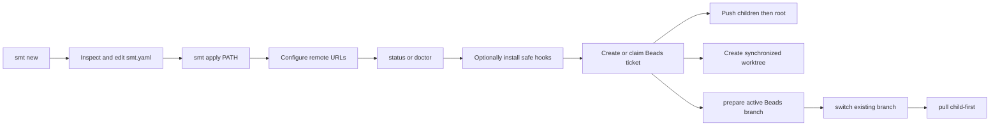

# SMT — Product Concept

SMT gives Sanovy developers and Codex agents one inspectable tool for a root
Git repository with independent submodules. It creates a reviewable blueprint
before applying a local platform workspace, then safely coordinates its normal
Git lifecycle without hiding state.

Its local workflow is:

Safety is the product: argument-array execution, an explicit blueprint review
before workspace creation, complete preflight before push/worktree side
effects, child-first pushes, root-first worktree creation, path containment,
harmless OS metadata filtering, no credential persistence, and no automatic
hook overwrite. A workspace hook install is all-repository-preflighted, then
root-first; it never forces, overwrites an unmanaged hook, or rolls back an
earlier install. The current CLI covers blueprint creation and application,
inspection, safe hook installation, configured pushes, linked worktrees,
Beads-branch preparation/switching, child-first pulls, and status/doctor
diagnostics. Agents create and claim work directly in Beads; SMT does not
provide ticket, review-queue, or release-readiness wrappers. The release path
is deliberately split: `release:build` makes four
local archives and checksums, while a clean `release:tag` creates and pushes an
annotated version tag. GitHub Actions now publishes a GitHub Release from that
tag with the four archives and checksum file.

Direct provider-native release CLI orchestration does not exist, and GitLab
release automation does not exist. Remote repository creation, external-clone
submodule URL synchronization, workspace submit orchestration, Jira aliases,
assignment waves, provider review automation, cloud or database actions,
deployment, rollback, and credential storage remain outside the current product
boundary.

Human `status` and `doctor` reports emphasize the next safe action. `doctor`
defaults to action-first output and offers `--tree` plus safe `--verbose` detail.
`status
--json` is intentionally separate for automation. Both may say that a
`commit-msg` hook is absent, current, or unmanaged; an unmanaged hook is a
human decision, never something SMT replaces. Generated `lefthook.yml` is a
scaffold, not proof that Lefthook has run or that a hook was installed.

## Planned module restructure

The next production milestone prioritizes a five-layer module model while
keeping the layers in this repository initially: control plane, application
components, shared infrastructure, quality, and platform/delivery. The
approved starter rewrite retains Web, Mobile, API, and Database, removes the
DevOps prompt, `workspace.stack.devops`, and combined `infra` repository from
new version-1 blueprints, and makes Podman/Compose the local runtime path.
Web, API, and PostgreSQL are planned to be runnable operational skeletons;
Mobile is planned as an Android/iOS starter rather than an OCI workload.

This is planned work, not current CLI behavior. The thin module contract is
being documented now; `smt extend` is explicitly deferred until the starter
restructure is implemented and accepted. See [[../superpowers/specs/2026-08-17-smt-extensible-modules-design|SMT Extensible Modules Design]] and [[../superpowers/plans/2026-08-17-smt-v0.1.0-production|SMT v0.1.0 Production Plan]]. Beads remains the delivery status source of truth.

## Related

- [[SMT - Implementation Spec]] — canonical behavior and boundaries.
- [[../10-development/SMT - Command Recipes]] — runnable examples.
- [[SMT - Agent Team]] — ownership and documentation workflow.
- [[../../AGENTS|Repository operating agreement]].
