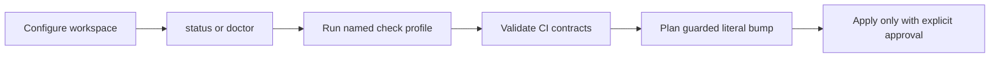

# SMT — Product Concept

SMT gives Sanovy developers and Codex agents one inspectable tool for a root
Git repository with independent submodules. The first release answers “is this
workspace ready?” and “what will this check or contract change do?” without
hiding Git state or silently modifying files.

Its local workflow is:

Safety is the product: argument-array execution, explicit worktree mutation
permission, plan-only changes, path containment, and no credential persistence.
The current CLI covers inspection, checks, contracts, CI audits, and guarded
contract bumps. The release path is deliberately split: `release:build` makes
four local archives and checksums, while a clean `release:tag` creates and
pushes an annotated version tag. GitHub Actions now publishes a GitHub Release
from that tag with the four archives and checksum file.

Direct provider-native release CLI orchestration does not exist, and GitLab
release automation does not exist. Checkout/submit orchestration, cloud or
database actions, deployment, rollback, and credential storage remain outside
the current product boundary.

## Related

- [[SMT - Implementation Spec]] — canonical behavior and boundaries.
- [[../10-development/SMT - Command Recipes]] — runnable examples.
- [[SMT - Agent Team]] — ownership and documentation workflow.
- [[../../AGENTS|Repository operating agreement]].
