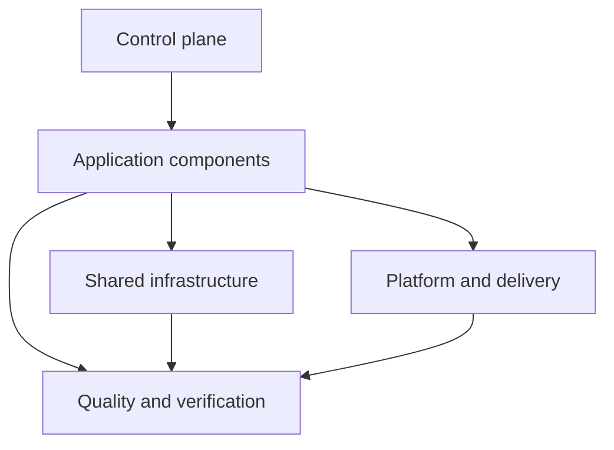

# SMT Extensible Modules Design

## Summary

This is the approved design direction for the next SMT production milestone.
It is planned work; the current CLI still follows [[../../00-project/SMT - Implementation Spec|the implemented specification]]. The immediate priority is to restructure the version-1 starter and define a thin module contract. `smt extend` is explicitly deferred until the starter and contract are accepted.

The guiding rule is: modules represent capabilities, while repositories
represent lifecycle and deployment boundaries. A module may remain in the
workspace repository until it needs independent ownership, release cadence,
or runtime operations.

## Five-layer model

Keep the layers in this repository initially. Extraction into separate
repositories is a later ownership decision.

1. **Control plane** — SMT, agent registry, module catalog, policies,
   compatibility, dependency graph, and workspace/worktree coordination.
2. **Application components** — Web, Mobile, API, worker, consumer, scheduler,
   and DAG.
3. **Shared infrastructure** — queue, database, cache, storage, and search.
4. **Quality** — integration, E2E, performance, and security.
5. **Platform and delivery** — container, CI/CD, observability, IaC,
   Kubernetes, and ArgoCD.



The system repository remains the authoritative product map; it is not a
sixth layer.

## Reviewed baseline

The approved production baseline for the planned starter is Go 1.26.5, pgx
v5.10.0, Next.js 16.2.9 on Node 24.18.0, Flutter 3.44.9, PostgreSQL 18, and
Podman 5.8.3 or newer with a Compose provider. These are reviewed target
constraints for the milestone, not evidence that the current CLI generates or
verifies them today.

## Planned version-1 restructure

Because there are no version-1 users to migrate, rewrite the starter contract
rather than preserve the current DevOps-shaped configuration. Retain Web,
Mobile, API, and Database. Remove `workspace.stack.devops`, the DevOps prompt,
and the combined `infra` repository from the planned starter. This is not yet
implemented, so current generated output must continue to be documented as
current behavior until the corresponding Beads work is accepted.

The planned starter is operational rather than a fake product: Web and API
are runnable, PostgreSQL is orchestrated locally with Podman Compose, and
Mobile is a runnable Android/iOS starter but not an OCI workload. It should
include health/readiness, graceful shutdown, migrations owned by the API,
non-root container images, lockfiles, and smoke commands without inventing
CRUD or domain behavior. Workspace creation remains deterministic and offline;
runtime tools are used only by later verification.

Platform capabilities are decomposed into `container`, `cicd`,
`observability`, `iac`, `k8s`, and `argocd`. `argocd` depends on `k8s`.
AWS + Apptainer + OpenTofu is a later discovery and compatibility milestone,
not part of this restructure.

## Thin module contract (planned)

The contract should be small enough to validate before implementation:

```yaml
module:
  id: e2e
  category: quality
  provides: [e2e]
  requires: []
  optional: [web, api, mobile]
  repository:
    path: e2e
    scope: e2e
```

Definitions should also be able to name agent/skill references, verification
requirements, and reviewed scaffold assets. Repository metadata should be
able to record `modules: [e2e]` without changing the existing version number.
The first catalog entry is an E2E scaffold, not a runtime test suite.

Generated component manifests and lockfiles are reviewed scaffold assets.
Skills and MCP integrations remain distinct metadata and prerequisite
declarations; they are never application dependencies or silently installed by
SMT.

The future `smt extend MODULE` command will plan and validate a module before
mutating Git or the workspace, support `--dry-run` and explicit confirmation,
and preserve argument-array execution and safe partial-state reporting. Its
implementation is deferred until the version-1 restructure is complete.

## Boundaries and acceptance

In scope for the restructure: the five-layer vocabulary, starter component
selection, Podman-first local runtime skeleton, platform capability names,
and the thin module contract. Out of scope: implementing `smt extend`, a
remote module registry, provider/cloud creation, fake CRUD, Kubernetes or
ArgoCD deployment, and AWS runtime selection.

Acceptance requires the canonical docs and generated guidance to distinguish
implemented behavior from planned behavior. Beads is the source of truth for
delivery status; this note records design intent only.

## Related

- [[../../10-development/SMT - Component Developer Toolchains|Component Developer Toolchains]]
- [[../../00-project/SMT - Product Concept|SMT — Product Concept]]
- [[../../00-project/SMT - Implementation Spec|SMT — Sanovy Mono Tool]]
- [[../../00-project/SMT - Agent Team|SMT — Agent Team]]
- [[../plans/2026-08-17-smt-v0.1.0-production|SMT v0.1.0 Production Plan]]
