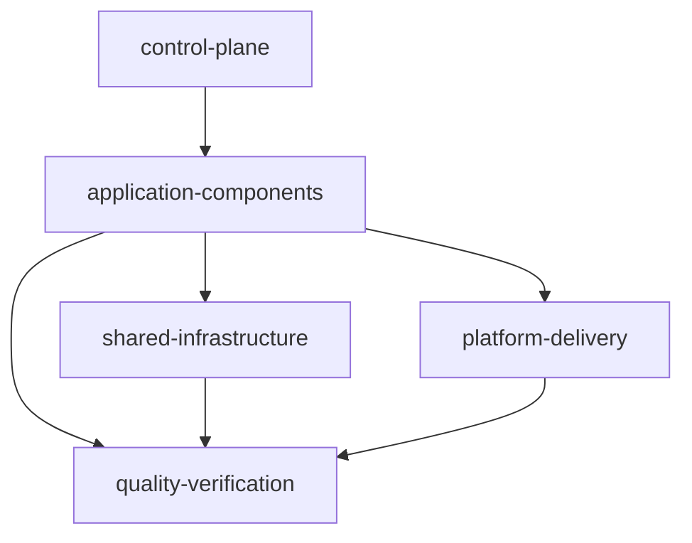

# SMT Extensible Modules Design

## Summary

This is the approved design direction for the next SMT production milestone.
The taxonomy and configuration portion of the version-1 starter restructure is
implemented: new blueprints select Web, optional Mobile, API, and Database,
with DevOps-shaped configuration removed. Generated blueprints also carry the
exact deterministic provenance contract in [[../../00-project/SMT - Implementation Spec#Configuration contract|the implementation specification]];
`smt apply` validates it before mutation. The runnable starter, platform
runtimes/artifacts, and runnable module assets remain planned work. The static
schema-v1 module catalog and repository annotations are implemented metadata;
`smt extend` is explicitly deferred.

The guiding rule is: modules represent capabilities, while repositories
represent lifecycle and deployment boundaries. A module may remain in the
workspace repository until it needs independent ownership, release cadence,
or runtime operations.

## Five-layer model

Keep the layers in this repository initially. Extraction into separate
repositories is a later ownership decision.

1. **`control-plane`** — SMT, agent registry, module catalog, policies,
   compatibility, dependency graph, and workspace/worktree coordination.
2. **`application-components`** — Web, Mobile, API, worker, consumer, scheduler,
   and DAG.
3. **`shared-infrastructure`** — queue, database, cache, storage, and search.
4. **`quality-verification`** — integration, E2E, performance, and security.
5. **`platform-delivery`** — container, CI/CD, observability, IaC,
   Kubernetes, and ArgoCD.

The system repository remains the authoritative product map; it is not a
sixth layer.

## Reviewed baseline

The approved production baseline for the planned starter is Go 1.26.5, pgx
v5.10.0, Next.js 16.2.9 on Node 24.18.0, Flutter 3.44.9, PostgreSQL 18, and
Podman 5.8.3 or newer with a Compose provider. These are reviewed target
constraints for the milestone, not evidence that the current CLI generates or
verifies them today.

## Implemented version-1 taxonomy change

Because there are no version-1 users to migrate, rewrite the starter contract
rather than preserve the DevOps-shaped configuration. New blueprints retain
Web, Mobile, API, and Database, with Mobile optional and ordered immediately
after Web. They omit `workspace.stack.devops`, the DevOps prompt, the combined
`infra` repository, and Docker/OpenTofu component or tooling metadata. Legacy
DevOps-shaped configurations are rejected before apply mutation with a
migration-oriented removal/regeneration error.

Generation is offline and byte-stable for identical selections in fresh
destinations. Missing, unsupported, or unknown provenance fails before service
or destination mutation; a general non-generated version-1 configuration may
remain usable for lifecycle and diagnostics without provenance but is not
applyable as a new generated blueprint. Existing destination files and
directories are refused without overwrite, merge, regeneration, upgrade, or
`smt extend` execution.

## Deferred runnable starter and platform runtime work

The planned starter is operational rather than a fake product: Web and API
are runnable, PostgreSQL is orchestrated locally with Podman Compose, and
Mobile is a runnable Android/iOS starter but not an OCI workload. It should
include health/readiness, graceful shutdown, migrations owned by the API,
non-root container images, lockfiles, and smoke commands without inventing
CRUD or domain behavior. Workspace creation remains deterministic and offline;
runtime tools are used only by later verification. `.3.1` now emits the
contract-only root `compose.yaml` and `.env.example`, but none of the runnable
component templates, Containerfiles, or Podman/Compose execution are provided
by this contract.

Platform capabilities are decomposed into `container`, `cicd`,
`observability`, `iac`, `k8s`, and `argocd`; the `.5` catalog implements these
as non-selectable declarations, and `argocd` depends on `k8s`. Their platform
repositories, scaffolds, runtime artifacts, and execution remain deferred.
AWS + Apptainer + OpenTofu is a later discovery and compatibility milestone,
not part of this restructure.

## Implemented `.3.1` root runtime contract

The generated root contains deterministic `compose.yaml` and `.env.example`
files, and root `.gitignore` ignores `.env`. Compose service IDs are only
`web`, `api`, and `database`; Mobile remains outside OCI Compose. API-only,
Database-only, Web-only, API+Database, all-OCI, empty, and Mobile-only
selections remain valid, with only selected OCI services emitted.

Default host bindings are Web `3000:3000`, API `8080:8080`, and Database
`5432:5432`, with canonical `WEB_PORT`, `API_PORT`, and `DATABASE_PORT`
overrides. The Compose project name is the normalized destination basename in
safe lowercase-hyphen form, capped at 63 characters, with
`smt-workspace` fallback. `.env.example` contains examples only, including an
empty `DATABASE_PASSWORD=`; no credentials or `.env` file is generated.

Web probes `/healthz`; API health/readiness are `/healthz` and `/readyz`; and
Database health uses `pg_isready`. Web-to-API and API-to-Database dependencies
are conditional and use `service_healthy`.

The pure `runtime.Preflight` API provides actionable invalid-port,
selected-port collision, occupied-port, missing-Podman, and missing Podman
Compose errors through injectable checks for later Taskfile/CLI use. It does
not execute external commands itself. `smt apply` renders the contract files
offline and does not invoke Preflight, Podman, Compose, socket probing, or
health checks. Component build contexts, Containerfiles, lifecycle tasks, and
application-domain behavior remain deferred to `.3.2` through `.3.6`.

## Implemented `.3.3.1` API manifest contract

When API is selected, apply writes deterministic static `go.mod` and `go.sum`
files into the API child repository. The module is `example.com/smt/apis` with
`go 1.26.5`. API-only requires Huma
`github.com/danielgtaylor/huma/v2 v2.39.1`; API+Database additionally requires
pgx `github.com/jackc/pgx/v5 v5.10.0` and golang-migrate
`github.com/golang-migrate/migrate/v4 v4.19.1`. No API selection emits no API
manifests.

The Go `tool` directives pin govulncheck
`golang.org/x/vuln/cmd/govulncheck` with `golang.org/x/vuln v1.7.0` and
golangci-lint
`github.com/golangci/golangci-lint/v2/cmd/golangci-lint` with
`github.com/golangci/golangci-lint/v2 v2.12.2`. API+Database additionally pins
`github.com/golang-migrate/migrate/v4/cmd/migrate`. Direct pinned sums are
present; full transitive closure is deferred.

Apply writes static templates only and performs no `go`, `go mod`,
package-manager, network, or tool installation work; PATH-empty tests cover
that boundary. gofmt, vet, test, race, coverage, fuzzing, Godex, and gopls are
SDK/editor/agent tools, not module dependencies. `go mod tidy` and `go mod verify`
are later checks against the eventual source closure, not proven
results here. API source imports, Huma/OpenAPI generation, tests, Containerfile,
and runtime verification remain deferred to `.3.3.2-.4`.

## Implemented static module catalog

Version 1 implements an optional repository-level `modules: [id...]` metadata
field; configurations without it remain valid. The static schema-v1 catalog is
owned by the SMT code and is not loaded from user YAML. It contains exactly 11
declarations: selectable `web`, `mobile`, `api`, `database`, and `e2e`; and
non-selectable platform declarations `container`, `cicd`, `observability`,
`iac`, `k8s`, and `argocd`.

Each catalog definition records its ID, selectable flag, category/layer,
provided/required and optional capabilities, safe placement defaults, stable
completion-criterion IDs, agent/skill references, argument-array verification
requirements including `mutates_worktree`, and reviewed scaffold-asset
identity where applicable. Placement modes are declarative and validated as
`attached`, `shared`, or `independent`; `.5` uses `attached` and `independent`
in its built-in declarations. The authoritative matrix is:

| ID | Placement (`path`, `scope`, `mode`, `targets`) | Completion criteria | Requires |
| --- | --- | --- | --- |
| `web` | `web-app`, `web`, `independent`, `[web]` | `web.declaration` | — |
| `mobile` | `mobile-app`, `mobile`, `independent`, `[mobile]` | `mobile.declaration` | — |
| `api` | `apis`, `api`, `independent`, `[api]` | `api.declaration` | — |
| `database` | `database`, `database`, `independent`, `[database]` | `database.declaration` | — |
| `e2e` | `.`, `repo`, `attached`, `[repo]` | `e2e.declaration` | — |
| `container` | `.`, `repo`, `attached`, `[web, api]` | `container.declaration` | — |
| `cicd` | `.`, `repo`, `attached`, `[repo, web, mobile, api, database]` | `cicd.repository-boundary` | — |
| `observability` | `.`, `repo`, `attached`, `[web, api, database]` | `observability.boundary` | — |
| `iac` | `platform/iac`, `iac`, `independent`, `[repo]` | `iac.provider-neutral` | — |
| `k8s` | `platform/k8s`, `k8s`, `independent`, `[repo]` | `k8s.static-validation` | — |
| `argocd` | `platform/argocd`, `argocd`, `independent`, `[repo]` | `argocd.sync-policy` | `k8s` |

Catalog validation rejects invalid schema, duplicate IDs/references, invalid
category/layer pairs, unknown module or capability references, unsafe paths,
invalid placement targets, duplicate completion criteria, and dependency
cycles. Configuration validation rejects unknown or duplicate repository module
IDs and missing selected required capabilities. `Config.LoadBytes` accepts
known non-selectable platform metadata when references and dependencies are
valid, while `Apply` and `ValidateBlueprint` reject non-selectable platform
metadata before topology checks, staging, or destination mutation.

`smt new` keeps the Web/Mobile/API/Database prompts, then asks the optional
default-no quality-root question derived from the catalog role and placement.
The current built-in prompt is `Include E2E quality declaration? [y/N]`.
Component repositories receive exact selectable IDs. Opting in records only
`modules: [e2e]` on the root; it creates no E2E repository, scaffold, or
artifact. The `.5` slice adds declarations and validation only: it creates no
platform repositories, platform scaffolds, or platform runtime artifacts; does
not install tools, skills, or MCP integrations; does not mutate host
configuration; and does not run Compose, Podman, Kubernetes, ArgoCD, or
OpenTofu. Runnable starters and `smt extend` remain deferred.

Generated component manifests and lockfiles remain deferred runnable-starter
assets. Skills and MCP integrations remain distinct metadata and prerequisite
declarations; they are never application dependencies or silently installed by
SMT.

The future `smt extend MODULE` command will plan and validate a module before
mutating Git or the workspace, support `--dry-run` and explicit confirmation,
and preserve argument-array execution and safe partial-state reporting. Its
implementation is deferred until the version-1 restructure is complete.

## Boundaries and acceptance

The accepted `.2` scope is the starter component taxonomy and configuration
gate; `.4` adds the selectable catalog and repository module annotations, `.5`
adds the six non-selectable platform declarations plus catalog/config
validation boundaries, and `.3.1` adds the root runtime contract artifacts.
Remaining design scope is the Podman-first runnable runtime skeleton and
platform runtime implementation. Out of scope for the current CLI are
runnable component templates, Containerfiles, platform
repositories/scaffolds/runtime artifacts, Podman/Compose execution, Kubernetes
or ArgoCD deployment, OpenTofu execution, a remote module registry,
implementing `smt extend`, provider/cloud creation, fake CRUD, and AWS runtime
selection.

Acceptance requires the canonical docs and generated guidance to distinguish
implemented behavior from planned behavior. Beads is the source of truth for
delivery status; this note records design intent only.

## Related

- [[../../10-development/SMT - Component Developer Toolchains|Component Developer Toolchains]]
- [[../../00-project/SMT - Product Concept|SMT — Product Concept]]
- [[../../00-project/SMT - Implementation Spec|SMT — Sanovy Mono Tool]]
- [[../../00-project/SMT - Agent Team|SMT — Agent Team]]
- [[../plans/2026-08-17-smt-v0.1.0-production|SMT v0.1.0 Production Plan]]
