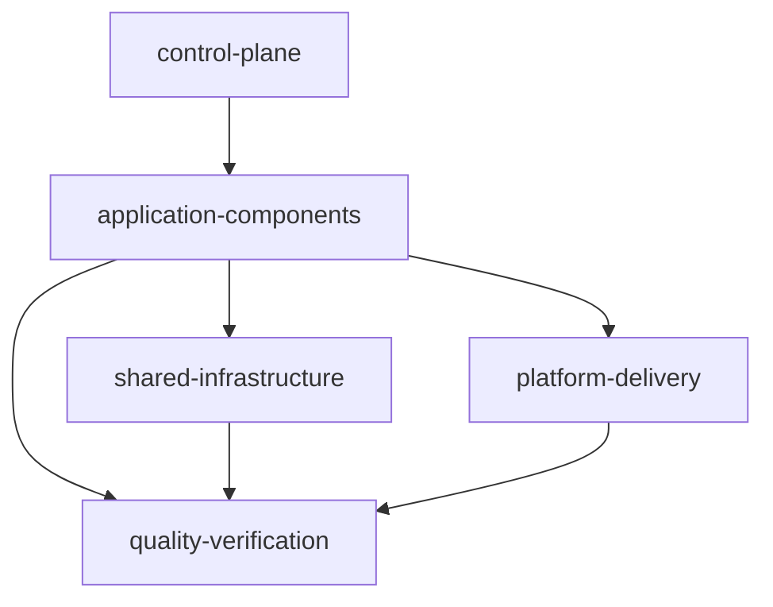

# SMT Extensible Modules Design

## Summary

This is the approved design direction for the next SMT production milestone.
The taxonomy and configuration portion of the version-1 starter restructure is
implemented: new blueprints select Web, optional Mobile, API, and Database,
with DevOps-shaped configuration removed. Generated blueprints also carry the
exact deterministic provenance contract in [[../../00-project/SMT - Implementation Spec#Configuration contract|the implementation specification]];
`smt apply` validates it before mutation. Remaining Web/Database runnable
module assets and Mobile runtime/verification remain planned work; the Mobile
`.3.5.1/.3.5.2` contracts are implemented below. `.3.5.2` uses the local
Flutter CLI to create the staged Android/iOS project; it does not use static
platform templates or Go post-create app, source, test, or analysis writes.
`.3.3.2` now implements the generated API runtime and OpenAPI starter assets.
The static schema-v1 module catalog and repository annotations are implemented
metadata; `smt extend` is explicitly deferred.

The guiding rule is: modules represent capabilities, while repositories
represent lifecycle and deployment boundaries. A module may remain in the
workspace repository until it needs independent ownership, release cadence,
or runtime operations.

## Five-layer model

Keep the layers in this repository initially. Extraction into separate
repositories is a later ownership decision.

1. **`control-plane`** — SMT, agent registry, module catalog, policies,
   compatibility, dependency graph, and workspace/worktree coordination.
2. **`application-components`** — Web, Mobile, API, worker, consumer, scheduler,
   and DAG.
3. **`shared-infrastructure`** — queue, database, cache, storage, and search.
4. **`quality-verification`** — integration, E2E, performance, and security.
5. **`platform-delivery`** — container, CI/CD, observability, IaC,
   Kubernetes, and ArgoCD.



The system repository remains the authoritative product map; it is not a
sixth layer.

## Reviewed baseline

The approved production baseline for the planned starter is Go 1.26.5, pgx
v5.10.0, Next.js 16.2.9 on Node 24.18.0, Flutter 3.44.9 stable, PostgreSQL 18, and
Podman 5.8.3 or newer with a Compose provider. These are reviewed target
constraints for the milestone; the current CLI now generates the accepted Go
API assets, while broader component generation and runtime verification remain
deferred.

## Implemented version-1 taxonomy change

Because there are no version-1 users to migrate, rewrite the starter contract
rather than preserve the DevOps-shaped configuration. New blueprints retain
Web, Mobile, API, and Database, with Mobile optional and ordered immediately
after Web. They omit `workspace.stack.devops`, the DevOps prompt, the combined
`infra` repository, and Docker/OpenTofu component or tooling metadata. Legacy
DevOps-shaped configurations are rejected before apply mutation with a
migration-oriented removal/regeneration error.

Generation is offline and byte-stable for identical selections in fresh
destinations. Missing, unsupported, or unknown provenance fails before service
or destination mutation; a general non-generated version-1 configuration may
remain usable for lifecycle and diagnostics without provenance but is not
applyable as a new generated blueprint. Existing destination files and
directories are refused without overwrite, merge, regeneration, upgrade, or
`smt extend` execution.

## Deferred runnable starter and platform runtime work

The end-state planned starter is operational rather than a fake product: Web
and API are runnable, PostgreSQL is orchestrated locally with Podman Compose,
and Mobile is a runnable Android/iOS starter but not an OCI workload. It should
include health/readiness, graceful shutdown, migrations owned by the API,
non-root container images, lockfiles, and smoke commands without inventing
CRUD or domain behavior. Workspace creation remains deterministic and offline;
runtime tools are used only by later verification. `.3.1` emits the
contract-only root `compose.yaml` and `.env.example`; `.3.3.2` emits the API
source/OpenAPI starter assets, and `.3.5.2` emits the Mobile source/platform
assets, but Web/Database templates, Containerfiles, packaging, and
Podman/Compose execution remain outside this contract.

Platform capabilities are decomposed into `container`, `cicd`,
`observability`, `iac`, `k8s`, and `argocd`; the `.5` catalog implements these
as non-selectable declarations, and `argocd` depends on `k8s`. Their platform
repositories, scaffolds, runtime artifacts, and execution remain deferred.
AWS + Apptainer + OpenTofu is a later discovery and compatibility milestone,
not part of this restructure.

## Approved mobile-first roadmap

The next P0 starter lane is Mobile rollup `smt-4xf.3.5` and children
`.3.5.1-.3`. Web rollup `smt-4xf.3.2` and children `.3.2.1-.3` remain P2 and
deferred; existing dependency edges are unchanged. Mobile starts independently
from current `main`, does not wait for an API PR, and does not require Web, API,
or Database. Keep Mobile backend-independent initially; typed API integration
follows after generated API/Database runtime work.

The delivery route is `work_manager -> mobile_worker -> doc_writer` for Mobile;
the existing `work_manager -> backend_worker -> doc_writer` route is unchanged.
`mobile_worker` owns only assigned Flutter/Dart production code and focused
tests, does not delegate, and must report unavailable SDK, device, Android, or
iOS lanes explicitly.

- **`.3.5.1` manifest/analysis (implemented)** — Flutter owns the Mobile
  `pubspec.yaml`, `analysis_options.yaml`, and project baseline for Flutter
  `>=3.44.9` and Dart `>=3.12.0 <4.0.0`. The `pubspec.lock` and pinned
  `flutter_lints 6.0.0` policy are produced and verified later by
  `mobile_worker` after `asdf exec flutter pub get`; Apply's `--no-pub` emits
  no lockfile and performs no package resolution. The generated root pins
  `flutter 3.44.9-stable`, and the README gives the pinned asdf install/current
  path.
- **`.3.5.2` runnable MVP (implemented)** — after staging root
  `.tool-versions`, Mobile Apply runs and preserves this exact command:

  ```sh
  asdf exec flutter --suppress-analytics create --empty --no-pub --platforms=android,ios --org=com.example.smt --project-name=smt_mobile --description="A provider-neutral SMT Flutter mobile starter." <staged-mobile-directory>
  ```

  Flutter owns the staged app/source/test/platform output. There are no static
  Android/iOS templates and no Go post-create app/source/test/analysis writes.
  If the pinned toolchain is unavailable, Apply reports
  `asdf install flutter 3.44.9-stable` and `asdf current flutter` guidance and
  fails atomically. Current evidence is asdf Flutter create, pub get, and
  analyze passing; Android SDK absence, incomplete Xcode, and missing CocoaPods
  leave device/build lanes unverified. Mobile remains backend-independent and
  outside OCI Compose.
- **`.3.5.3` verification (deferred/planned)** — `dart format`,
  `flutter analyze`, unit/widget tests, `integration_test`, Android debug
  builds, and iOS debug builds with `--no-codesign` where supported remain
  unverified. Unavailable Flutter/Dart/Android/iOS SDK or device lanes are
  explicit results, never silently skipped.
- **`.6.1.3` Mobile Taskfile** — activates only after the Mobile rollup closes,
  with dependency, format, analyze, test, integration, Android debug, iOS
  debug, and aggregate `verify` tasks.

`.3.5.1` and `.3.5.2` are implemented. Remaining Mobile work is `.3.5.3`
verification; Mobile remains outside OCI Compose.

## Implemented `.3.1` root runtime contract

The generated root contains deterministic `compose.yaml` and `.env.example`
files, and root `.gitignore` ignores `.env`. Compose service IDs are only
`web`, `api`, and `database`; Mobile remains outside OCI Compose. API-only,
Database-only, Web-only, API+Database, all-OCI, empty, and Mobile-only
selections remain valid, with only selected OCI services emitted.

Default host bindings are Web `3000:3000`, API `8080:8080`, and Database
`5432:5432`, with canonical `WEB_PORT`, `API_PORT`, and `DATABASE_PORT`
overrides. The Compose project name is the normalized destination basename in
safe lowercase-hyphen form, capped at 63 characters, with
`smt-workspace` fallback. `.env.example` contains examples only, including an
empty `DATABASE_PASSWORD=`; no credentials or `.env` file is generated.

Web probes `/healthz`; API health/readiness are `/healthz` and `/readyz`; and
Database health uses `pg_isready`. Web-to-API and API-to-Database dependencies
are conditional and use `service_healthy`.

The pure `runtime.Preflight` API provides actionable invalid-port,
selected-port collision, occupied-port, missing-Podman, and missing Podman
Compose errors through injectable checks for later Taskfile/CLI use. It does
not execute external commands itself. `smt apply` renders the contract files
offline and does not invoke Preflight, Podman, Compose, socket probing, or
health checks. Remaining Web/Database build contexts, Containerfiles, Mobile
platform SDK/device verification, lifecycle tasks, and application-domain
behavior remain deferred; `.3.3.2` owns the generated API source/Taskfile
contract and `.3.5.2` owns the generated Mobile source/platform assets.

## Implemented `.3.3.1` API manifest contract

When API is selected, apply writes deterministic static `go.mod` and `go.sum`
files into the API child repository. The module is `example.com/smt/apis` with
`go 1.26.5`. API-only requires Huma
`github.com/danielgtaylor/huma/v2 v2.39.1`; API+Database additionally requires
pgx `github.com/jackc/pgx/v5 v5.10.0` and golang-migrate
`github.com/golang-migrate/migrate/v4 v4.19.1`. No API selection emits no API
manifests.

The Go `tool` directives pin govulncheck
`golang.org/x/vuln/cmd/govulncheck` with `golang.org/x/vuln v1.7.0` and
golangci-lint
`github.com/golangci/golangci-lint/v2/cmd/golangci-lint` with
`github.com/golangci/golangci-lint/v2 v2.12.2`. API+Database additionally pins
`github.com/golang-migrate/migrate/v4/cmd/migrate`. Direct pinned sums are
present; full transitive closure is deferred.

Apply writes static templates only and performs no `go`, `go mod`,
package-manager, network, or tool installation work; PATH-empty tests cover
that boundary. gofmt, vet, test, race, coverage, fuzzing, Godex, and gopls are
SDK/editor/agent tools, not module dependencies. `go mod tidy` remains a later
source-closure check; the generated child `mod` task exercises `go mod verify`
for the emitted manifest.

## Implemented `.3.3.2` API runtime and OpenAPI assets

API-selected Apply emits deterministic `main.go`, `internal/server/server.go`,
`cmd/openapi/main.go`, `.env.example`, `openapi.yaml`, and `Taskfile.yml` in the API child
repository alongside the `.3.3.1` manifests. No API selection emits no API
child or API assets. The module is `example.com/smt/apis` on Go `1.26.5`;
Huma v2.39.1 is used through the Gin adapter with Gin v1.12.0 and Prometheus
`github.com/prometheus/client_golang v1.24.1`. API-only source remains free of pgx, migrate, and
database code; API+Database retains pgx/migrate manifest dependencies only.

The runtime uses JSON `slog` and defaults `HTTP_ADDR=:8080`,
`APP_ENV=development`, `LOG_LEVEL=info`, `HTTP_READ_TIMEOUT=15s`,
`HTTP_READ_HEADER_TIMEOUT=5s`, `HTTP_WRITE_TIMEOUT=15s`,
`HTTP_IDLE_TIMEOUT=60s`, `HTTP_MAX_HEADER_BYTES=1048576`, and
`HTTP_SHUTDOWN_TIMEOUT=10s`. Shared Huma metadata is OpenAPI 3.1, title
`SMT API`, version `v0.1.0`, with `/docs`, `/openapi.json`, and `/openapi.yaml`
routes. `cmd/openapi` constructs the shared Huma API and writes
`api.OpenAPI().YAML()` offline without a listener. The committed
`openapi.yaml` is byte-identical to regeneration across fresh Apply
destinations.

The generated server `Config` carries direct `github.com/caarlos0/env/v11
v11.4.1` `env`/`envDefault` tags on its typed fields, including `slog.Level`
for `LogLevel` and `time.Duration` for the timeout fields. `LoadConfig()` calls
plain `env.Parse(&cfg)`; native caarlos/TextUnmarshaler parsing controls
malformed-value errors; no separate semantic conversion or post-parse
validation is added. `Run` logs a structured `configuration load failed`
event and panics with the native parse error before constructing the
application. Normal Gin/Huma runtime and graceful-shutdown behavior is
unchanged. The exact pin and direct checksums are present in the API-only and
API+Database manifests.
API-selected Apply also emits a deterministic child `Taskfile.yml` with
top-level `dotenv: ['.env']`; it does not copy or mutate `.env`. The tasks are
`build` with trimpath output `bin/apis`, `run` of that built binary, `test`,
`coverage`, `mod` (`go mod verify`), offline byte-comparing `openapi`, and
`verify` depending on `build`, `test`, `mod`, and `openapi` before `go vet
./...`. API+Database gets the same API Taskfile and no database
migration/readiness tasks yet; those belong to `smt-4xf.6.1.2` and later. The
Task v3.52.0 child harness verified dotenv-driven `/healthz` and bounded
process cleanup.

`/healthz` returns 200 `status: ok`; `/readyz` returns 503 `not_ready` before
bootstrap or during shutdown and 200 `ready` after bootstrap. `/metrics` uses
the same listener and exposes Go/process plus bounded request metrics. Safe
`X-Request-ID` values are accepted or generated and returned. Custom Gin panic
recovery logs panic/stack/route/method/request ID through JSON `slog` and
returns generic 500. SIGINT/SIGTERM marks the service not ready and performs
graceful shutdown with the configured timeout.

Apply writes embedded deterministic assets only: no network, Go or
package-manager command, tool installation, Podman, listener, or runtime
execution. No credentials, domain CRUD, DB connectivity/readiness, migrations,
root Taskfile changes, Containerfiles, non-root packaging, or `smt extend` are
added; Apply never executes the generated child Taskfile. No implicit installs
or network work are performed.
Durable unit/race/fuzz/integration coverage is `.3.3.3`; non-root packaging and
runtime verification are `.3.3.4`. Later human and Podman gates remain
required. No `go mod tidy` or human E2E completion is claimed here; `go mod
verify` evidence is limited to the generated child Task harness.

## Implemented static module catalog

Version 1 implements an optional repository-level `modules: [id...]` metadata
field; configurations without it remain valid. The static schema-v1 catalog is
owned by the SMT code and is not loaded from user YAML. It contains exactly 11
declarations: selectable `web`, `mobile`, `api`, `database`, and `e2e`; and
non-selectable platform declarations `container`, `cicd`, `observability`,
`iac`, `k8s`, and `argocd`.

Each catalog definition records its ID, selectable flag, category/layer,
provided/required and optional capabilities, safe placement defaults, stable
completion-criterion IDs, agent/skill references, argument-array verification
requirements including `mutates_worktree`, and reviewed scaffold-asset
identity where applicable. Placement modes are declarative and validated as
`attached`, `shared`, or `independent`; `.5` uses `attached` and `independent`
in its built-in declarations. The authoritative matrix is:

| ID | Placement (`path`, `scope`, `mode`, `targets`) | Completion criteria | Requires |
| --- | --- | --- | --- |
| `web` | `web-app`, `web`, `independent`, `[web]` | `web.declaration` | — |
| `mobile` | `mobile-app`, `mobile`, `independent`, `[mobile]` | `mobile.declaration` | — |
| `api` | `apis`, `api`, `independent`, `[api]` | `api.declaration` | — |
| `database` | `database`, `database`, `independent`, `[database]` | `database.declaration` | — |
| `e2e` | `.`, `repo`, `attached`, `[repo]` | `e2e.declaration` | — |
| `container` | `.`, `repo`, `attached`, `[web, api]` | `container.declaration` | — |
| `cicd` | `.`, `repo`, `attached`, `[repo, web, mobile, api, database]` | `cicd.repository-boundary` | — |
| `observability` | `.`, `repo`, `attached`, `[web, api, database]` | `observability.boundary` | — |
| `iac` | `platform/iac`, `iac`, `independent`, `[repo]` | `iac.provider-neutral` | — |
| `k8s` | `platform/k8s`, `k8s`, `independent`, `[repo]` | `k8s.static-validation` | — |
| `argocd` | `platform/argocd`, `argocd`, `independent`, `[repo]` | `argocd.sync-policy` | `k8s` |

Catalog validation rejects invalid schema, duplicate IDs/references, invalid
category/layer pairs, unknown module or capability references, unsafe paths,
invalid placement targets, duplicate completion criteria, and dependency
cycles. Configuration validation rejects unknown or duplicate repository module
IDs and missing selected required capabilities. `Config.LoadBytes` accepts
known non-selectable platform metadata when references and dependencies are
valid, while `Apply` and `ValidateBlueprint` reject non-selectable platform
metadata before topology checks, staging, or destination mutation.

`smt new` keeps the Web/Mobile/API/Database prompts, then asks the optional
default-no quality-root question derived from the catalog role and placement.
The current built-in prompt is `Include E2E quality declaration? [y/N]`.
Component repositories receive exact selectable IDs. Opting in records only
`modules: [e2e]` on the root; current Apply remains metadata-only. The P0
`smt-4xf.14` rollup will generate separate attached `e2e/web` and `e2e/mobile`
packages only for selected Web or Mobile targets; no-target E2E remains valid
metadata-only. Web uses Playwright and Mobile uses Flutter's native
`integration_test`, with contract smoke for stable hooks, Web `/healthz`,
optional API reachability, and Mobile `mobile-home`/`api-status`. Local tasks
delegate startup/shutdown to existing component tasks and report unavailable
browser/device lanes explicitly. Apply still does not install dependencies,
browsers, SDKs, devices, credentials, or remote CI. The `.5` slice retains its
platform/runtime boundaries, and `smt extend` remains deferred.

Remaining Web/Database component manifests and lockfiles are deferred
runnable-starter assets; Mobile `.3.5.1` lockfile/lint production and
verification occur after `pub get`, while `.3.5.2` is the implemented Flutter
CLI project/source/platform baseline.
Skills and MCP integrations remain distinct metadata and prerequisite
declarations; they are never application dependencies or silently installed by
SMT.

The future `smt extend MODULE` command will plan and validate a module before
mutating Git or the workspace, support `--dry-run` and explicit confirmation,
and preserve argument-array execution and safe partial-state reporting. Its
implementation is deferred until the version-1 restructure is complete.

## Boundaries and acceptance

The accepted `.2` scope is the starter component taxonomy and configuration
gate; `.4` adds the selectable catalog and repository module annotations, `.5`
adds the six non-selectable platform declarations plus catalog/config
validation boundaries, `.3.1` adds the root runtime contract artifacts, and
`.3.3.2` adds the generated API runtime/OpenAPI assets. Remaining design scope
is the remaining P0 Mobile verification lane followed by the P2/deferred Web
and remaining Database starter work, packaging, and Podman-first runtime
implementation. Out of scope for the current CLI are Web/Mobile/Database
Containerfiles, platform
repositories/scaffolds/runtime artifacts, Podman/Compose execution, Kubernetes
or ArgoCD deployment, OpenTofu execution, a remote module registry,
implementing `smt extend`, provider/cloud creation, fake CRUD, and AWS runtime
selection.

Acceptance requires the canonical docs and generated guidance to distinguish
implemented behavior from planned behavior. Beads is the source of truth for
delivery status; this note records design intent only.

## Related

- [[../../10-development/SMT - Component Developer Toolchains|Component Developer Toolchains]]
- [[../../00-project/SMT - Product Concept|SMT — Product Concept]]
- [[../../00-project/SMT - Implementation Spec|SMT — Sanovy Mono Tool]]
- [[../../00-project/SMT - Agent Team|SMT — Agent Team]]
- [[../plans/2026-08-17-smt-v0.1.0-production|SMT v0.1.0 Production Plan]]
