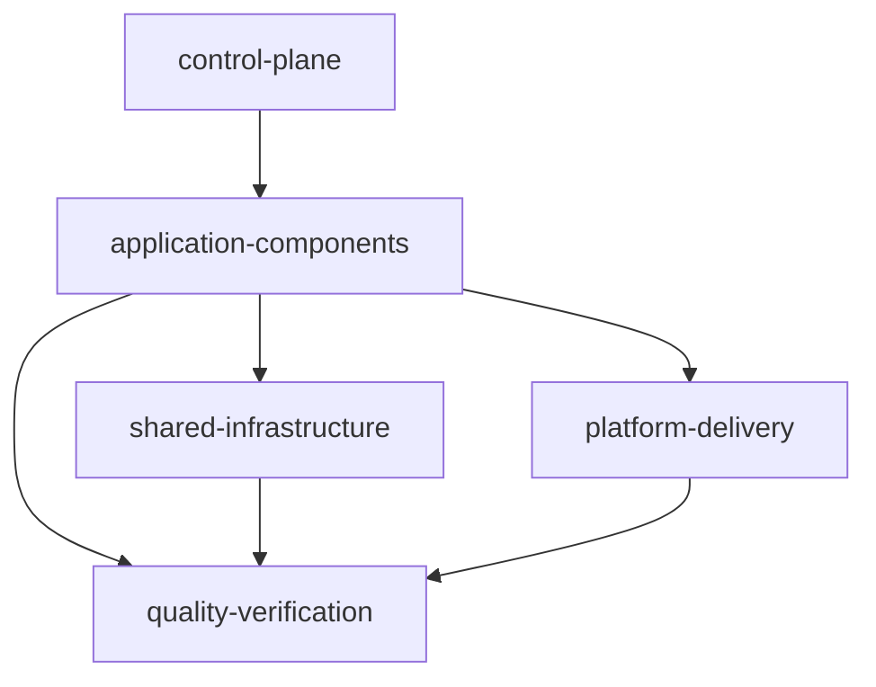

# SMT Extensible Modules Design

## Summary

This is the approved design direction for the next SMT production milestone.
The taxonomy and configuration portion of the version-1 starter restructure is
implemented: new blueprints select Web, optional Mobile, API, and Database,
with DevOps-shaped configuration removed. Generated blueprints also carry the
exact deterministic provenance contract in [[../../00-project/SMT - Implementation Spec#Configuration contract|the implementation specification]];
`smt apply` validates it before mutation. The runnable starter, platform
capabilities, and runnable module assets remain planned work. The static
schema-v1 module catalog and repository annotations are implemented metadata;
`smt extend` is explicitly deferred.

The guiding rule is: modules represent capabilities, while repositories
represent lifecycle and deployment boundaries. A module may remain in the
workspace repository until it needs independent ownership, release cadence,
or runtime operations.

## Five-layer model

Keep the layers in this repository initially. Extraction into separate
repositories is a later ownership decision.

1. **`control-plane`** — SMT, agent registry, module catalog, policies,
   compatibility, dependency graph, and workspace/worktree coordination.
2. **`application-components`** — Web, Mobile, API, worker, consumer, scheduler,
   and DAG.
3. **`shared-infrastructure`** — queue, database, cache, storage, and search.
4. **`quality-verification`** — integration, E2E, performance, and security.
5. **`platform-delivery`** — container, CI/CD, observability, IaC,
   Kubernetes, and ArgoCD.

The system repository remains the authoritative product map; it is not a
sixth layer.

## Reviewed baseline

The approved production baseline for the planned starter is Go 1.26.5, pgx
v5.10.0, Next.js 16.2.9 on Node 24.18.0, Flutter 3.44.9, PostgreSQL 18, and
Podman 5.8.3 or newer with a Compose provider. These are reviewed target
constraints for the milestone, not evidence that the current CLI generates or
verifies them today.

## Implemented version-1 taxonomy change

Because there are no version-1 users to migrate, rewrite the starter contract
rather than preserve the DevOps-shaped configuration. New blueprints retain
Web, Mobile, API, and Database, with Mobile optional and ordered immediately
after Web. They omit `workspace.stack.devops`, the DevOps prompt, the combined
`infra` repository, and Docker/OpenTofu component or tooling metadata. Legacy
DevOps-shaped configurations are rejected before apply mutation with a
migration-oriented removal/regeneration error.

Generation is offline and byte-stable for identical selections in fresh
destinations. Missing, unsupported, or unknown provenance fails before service
or destination mutation; a general non-generated version-1 configuration may
remain usable for lifecycle and diagnostics without provenance but is not
applyable as a new generated blueprint. Existing destination files and
directories are refused without overwrite, merge, regeneration, upgrade, or
`smt extend` execution.

## Deferred runnable starter and platform work

The planned starter is operational rather than a fake product: Web and API
are runnable, PostgreSQL is orchestrated locally with Podman Compose, and
Mobile is a runnable Android/iOS starter but not an OCI workload. It should
include health/readiness, graceful shutdown, migrations owned by the API,
non-root container images, lockfiles, and smoke commands without inventing
CRUD or domain behavior. Workspace creation remains deterministic and offline;
runtime tools are used only by later verification. None of those runnable
templates or Podman/Compose artifacts are provided by the accepted taxonomy
change.

Platform capabilities are decomposed into `container`, `cicd`,
`observability`, `iac`, `k8s`, and `argocd`. `argocd` depends on `k8s`.
AWS + Apptainer + OpenTofu is a later discovery and compatibility milestone,
not part of this restructure.

## Implemented static module catalog

Version 1 implements an optional repository-level `modules: [id...]` metadata
field; configurations without it remain valid. The static schema-v1 catalog is
owned by the SMT code and is not loaded from user YAML. Its selectable entries
are exactly `web`, `mobile`, `api`, `database`, and `e2e` (the quality
declaration). The full layer vocabulary is `control-plane`,
`application-components`, `shared-infrastructure`, `quality-verification`, and
`platform-delivery`, but the built-in catalog has no control-plane or platform
entry. Web, Mobile, and API use `application-components`, Database uses
`shared-infrastructure`, and E2E uses `quality-verification`.

Each catalog definition records its ID, category/layer, provided/required and
optional capabilities, safe placement defaults, agent/skill references,
argument-array verification requirements including `mutates_worktree`, and
reviewed scaffold-asset identity. Catalog validation rejects invalid schema,
duplicate IDs, invalid category/layer pairs, unknown capability references,
unsafe paths, and dependency cycles. Configuration validation rejects unknown
or duplicate repository module IDs and missing selected required capabilities.

`smt new` keeps the Web/Mobile/API/Database prompts, then asks the optional
default-no quality-root question derived from the catalog role and placement.
The current built-in prompt is `Include E2E quality declaration? [y/N]`.
Component repositories receive exact IDs. Opting in records only
`modules: [e2e]` on the root; it creates no E2E repository, scaffold, or
artifact. `smt apply` requires the exact generated root/component annotations
and persists them, but it does not execute verification recipes, install
tools, skills, or MCP integrations, mutate host configuration, or create
module repositories.

Generated component manifests and lockfiles remain deferred runnable-starter
assets. Skills and MCP integrations remain distinct metadata and prerequisite
declarations; they are never application dependencies or silently installed by
SMT.

The future `smt extend MODULE` command will plan and validate a module before
mutating Git or the workspace, support `--dry-run` and explicit confirmation,
and preserve argument-array execution and safe partial-state reporting. Its
implementation is deferred until the version-1 restructure is complete.

## Boundaries and acceptance

The accepted `.2` scope is the starter component taxonomy and configuration
gate; `.4` adds the static catalog and repository module annotations above.
Remaining design scope is the Podman-first local runtime skeleton and platform
capability implementation. Out of scope for the current CLI are runnable
templates, Podman/Compose artifacts, platform artifacts/capabilities, a remote
module registry, implementing `smt extend`, provider/cloud creation, fake CRUD,
Kubernetes or ArgoCD deployment, and AWS runtime selection.

Acceptance requires the canonical docs and generated guidance to distinguish
implemented behavior from planned behavior. Beads is the source of truth for
delivery status; this note records design intent only.

## Related

- [[../../10-development/SMT - Component Developer Toolchains|Component Developer Toolchains]]
- [[../../00-project/SMT - Product Concept|SMT — Product Concept]]
- [[../../00-project/SMT - Implementation Spec|SMT — Sanovy Mono Tool]]
- [[../../00-project/SMT - Agent Team|SMT — Agent Team]]
- [[../plans/2026-08-17-smt-v0.1.0-production|SMT v0.1.0 Production Plan]]
