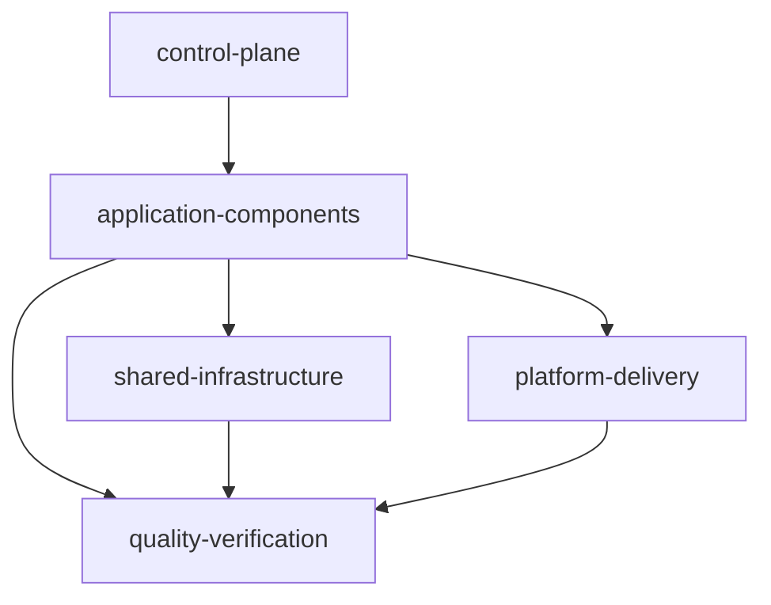

# SMT Extensible Modules Design

## Summary

This is the approved design direction for the next SMT production milestone.
The taxonomy and configuration portion of the version-1 starter restructure is
implemented: new blueprints select Web, optional Mobile, API, and Database,
with DevOps-shaped configuration removed. Generated blueprints also carry the
exact deterministic provenance contract in [[../../00-project/SMT - Implementation Spec#Configuration contract|the implementation specification]];
`smt apply` validates it before mutation. The Web `.3.2.1` CLI baseline and
the Mobile `.3.5.1/.3.5.2/.3.5.3` contracts are implemented below; remaining
Web quality/runtime work, Database runnable assets, and packaging remain
planned. `.3.2.1` uses the local Next.js CLI to create the staged Web project;
it preserves CLI files, merges ignores, and does not install packages during
Apply. `.3.5.2` uses the local Flutter CLI to create the staged Android/iOS
project, and `.3.5.3` adds the stable app/test contract; it does not use
static platform templates. Mobile integration/device/build lanes remain
explicitly unverified where the host lacks the required SDK or target.
`.3.3.2` now implements the generated API runtime and OpenAPI starter assets.
The static schema-v1 module catalog and repository annotations are implemented
metadata; `smt extend` is explicitly deferred.

The guiding rule is: modules represent capabilities, while repositories
represent lifecycle and deployment boundaries. A module may remain in the
workspace repository until it needs independent ownership, release cadence,
or runtime operations.

## Five-layer model

Keep the layers in this repository initially. Extraction into separate
repositories is a later ownership decision.

1. **`control-plane`** — SMT, agent registry, module catalog, policies,
   compatibility, dependency graph, and workspace/worktree coordination.
2. **`application-components`** — Web, Mobile, API, worker, consumer, scheduler,
   and DAG.
3. **`shared-infrastructure`** — queue, database, cache, storage, and search.
4. **`quality-verification`** — integration, E2E, performance, and security.
5. **`platform-delivery`** — container, CI/CD, observability, IaC,
   Kubernetes, and ArgoCD.



The system repository remains the authoritative product map; it is not a
sixth layer.

## Reviewed baseline

The approved production baseline for the planned starter is Go 1.26.5, pgx
v5.10.0, Next.js 16.2.9 on Node 24.18.0, Flutter 3.44.9 stable, PostgreSQL 18, and
Podman 5.8.3 or newer with a Compose provider. These are reviewed target
constraints for the milestone; the current CLI now generates the accepted Web
`.3.2.1` baseline and Go API assets, while broader component generation and
runtime verification remain deferred.

## Implemented version-1 taxonomy change

Because there are no version-1 users to migrate, rewrite the starter contract
rather than preserve the DevOps-shaped configuration. New blueprints retain
Web, Mobile, API, and Database, with Mobile optional and ordered immediately
after Web. They omit `workspace.stack.devops`, the DevOps prompt, the combined
`infra` repository, and Docker/OpenTofu component or tooling metadata. Legacy
DevOps-shaped configurations are rejected before apply mutation with a
migration-oriented removal/regeneration error.

Blueprint and static generation remains byte-stable without network access for
identical selections in fresh destinations. Selected Web `.3.2.1` Apply is the
documented pinned `npx` initializer exception and may access the npm registry
without installing or resolving dependencies. All other Apply paths remain
offline. Missing, unsupported, or unknown provenance fails before service or
destination mutation; a general non-generated version-1 configuration may
remain usable for lifecycle and diagnostics without provenance but is not
applyable as a new generated blueprint. Existing destination files and
directories are refused without overwrite, merge, regeneration, upgrade, or
`smt extend` execution.

## Deferred runnable starter and platform runtime work

The end-state planned starter is operational rather than a fake product: Web
and API are runnable, PostgreSQL is orchestrated locally with Podman Compose,
and Mobile is a runnable Android/iOS starter but not an OCI workload. It should
include health/readiness, graceful shutdown, migrations owned by the API,
non-root container images, lockfiles, and smoke commands without inventing
CRUD or domain behavior. Workspace creation remains deterministic; blueprint,
static, and non-Web paths are offline. Selected Web `.3.2.1` uses the pinned
`npx create-next-app` exception and may access the npm registry, but it still
performs no installation or dependency resolution. Runtime tools are used only
by later verification. `.3.1` emits the root `compose.yaml`, `.env.example`,
and, for identity selection, `traefik/dynamic.yaml`; when an OCI service is
selected, it also emits a root Taskfile whose Compose commands
pass the operator-managed `.env` explicitly; `.3.2.1` uses the local
Next.js CLI for the Web baseline; `.3.3.2` emits the API source/OpenAPI starter
assets; `.3.4.1` emits the independent Database runtime/readiness assets; and
`.3.5.2` emits the Mobile source/platform assets. Web dependency, quality,
browser, and runtime work, remaining Containerfiles, packaging, and broader
Podman/Compose lifecycle verification remain outside this contract. The root
Taskfile entrypoints are operator-run and do not create `.env` or credentials.

Platform capabilities are decomposed into `container`, `cicd`,
`observability`, `iac`, `k8s`, and `argocd`; the `.5` catalog implements these
as non-selectable declarations, and `argocd` depends on `k8s`. Their platform
repositories, scaffolds, runtime artifacts, and execution remain deferred.
AWS + Apptainer + OpenTofu is a later discovery and compatibility milestone,
not part of this restructure.

## Accepted Web `.3.2.1` CLI initializer

The Web baseline is Next.js `16.2.9` on root-pinned Node.js `24.18.0`. When
Web is selected, Apply stages the child and invokes this exact argument-array
command:

```sh
asdf exec npx --yes create-next-app@16.2.9 <staged-web-directory> --typescript --eslint --app --empty --tailwind --use-pnpm --skip-install --disable-git --agents-md --import-alias=@/*
```

The Next.js CLI owns the generated `package.json`, App Router, Tailwind,
`AGENTS.md`, and other baseline files. Apply preserves those files, merges the
CLI `.gitignore`, publishes no package-manager lockfile, and performs no
`pnpm install` or dependency resolution. The CLI output is staged before
publication; a failure retains its output in the error, reports
`asdf install nodejs 24.18.0`, `asdf current nodejs`, and the pinned CLI
`--help` path, and leaves no published partial destination.

This pinned `npx create-next-app` call is the sole Apply exception that may
access the npm registry. Non-Web and static Apply paths remain offline; Web
still performs no `pnpm install`, lockfile publication, or dependency
resolution.

Web selection also generates `web_worker` routing and skills metadata. The
worker owns assigned Next.js/TypeScript production code and focused tests and
uses `build-web-apps:react-best-practices` and
`build-web-apps:frontend-testing-debugging`. After Apply, the local workflow is
`pnpm install` followed by `pnpm run dev` from `web-app/`. The later
`.3.2.2/.3` lanes own pnpm lockfile creation, quality, browser, and runtime
verification; `.3.2.1` claims no real Web pnpm, browser, or runtime
evidence.

## Approved mobile-first roadmap

The next P0 starter lane is Mobile rollup `smt-4xf.3.5` and children
`.3.5.1-.3`. Web rollup `smt-4xf.3.2` and children `.3.2.1-.3` remain P2 and
deferred as a rollup; `.3.2.1` is implemented and `.3.2.2/.3` remain deferred.
Existing dependency edges are unchanged. Mobile starts independently
from current `main`, does not wait for an API PR, and does not require Web, API,
or Database. Keep Mobile backend-independent initially; typed API integration
follows after generated API/Database runtime work.

The delivery route is `work_manager -> mobile_worker -> doc_writer` for Mobile;
the existing `work_manager -> backend_worker -> doc_writer` route is unchanged.
`mobile_worker` owns only assigned Flutter/Dart production code and focused
tests, does not delegate, and must report unavailable SDK, device, Android, or
iOS lanes explicitly.

- **`.3.5.1` manifest/analysis (implemented)** — Flutter owns the Mobile
  `pubspec.yaml`, `analysis_options.yaml`, and project baseline for Flutter
  `>=3.44.9` and Dart `>=3.12.0 <4.0.0`. The `pubspec.lock` and pinned
  `flutter_lints 6.0.0` policy are produced and verified later by
  `mobile_worker` after `asdf exec flutter pub get`; Apply's `--no-pub` emits
  no lockfile and performs no package resolution. The generated root pins
  `flutter 3.44.9-stable`, and the README gives the pinned asdf install/current
  path.
- **`.3.5.2` runnable MVP (implemented)** — after staging root
  `.tool-versions`, Mobile Apply runs and preserves this exact command:

  ```sh
  asdf exec flutter --suppress-analytics create --empty --no-pub --platforms=android,ios --org=com.example.smt --project-name=smt_mobile --description="A provider-neutral SMT Flutter mobile starter." <staged-mobile-directory>
  ```

  Flutter owns the staged platform output. There are no static Android/iOS
  templates; the Mobile worker owns the post-create app/source/test/config
  contract.
  If the pinned toolchain is unavailable, Apply reports
  `asdf install flutter 3.44.9-stable` and `asdf current flutter` guidance and
  fails atomically. Current evidence is asdf Flutter create, pub get, and
  analyze passing; Android SDK absence, incomplete Xcode, and missing CocoaPods
  leave device/build lanes unverified. Mobile remains backend-independent and
  outside OCI Compose.
- **`.3.5.3` verification (implemented)** — the Mobile worker adds the stable
  app/config/unit/widget/native-integration contract and verifies Dart format,
  `flutter analyze`, and unit/widget tests. The host has no Android SDK or
  supported Android/iOS target, so integration and debug-build lanes are
  explicit unverified results, never silently skipped.
- **`.6.1.3` Mobile native verification** — activates after the Mobile rollup
  closes with direct `asdf exec flutter` format, analyze, test, integration,
  and debug-build lanes plus a fast format/analyze Lefthook profile. It does
  not generate a Mobile Taskfile.

`.3.5.1`, `.3.5.2`, and `.3.5.3` are implemented; unavailable Mobile device
and debug-build lanes remain explicit gaps. Mobile remains outside OCI Compose.

## Implemented `.3.1` root runtime contract

The generated root contains deterministic `compose.yaml` and `.env.example`
files and, for identity selection, `traefik/dynamic.yaml`; root `.gitignore`
ignores `.env`. Compose service IDs are only
`web`, `api`, and `database`; Mobile remains outside OCI Compose. API-only,
Database-only, Web-only, API+Database, all-OCI, empty, and Mobile-only
selections remain valid, with only selected OCI services emitted.

Default host bindings are Web `3000:3000`, API `8080:8080`, and Database
`5432:5432`, with canonical `WEB_PORT`, `API_PORT`, and `DATABASE_PORT`
overrides. The generated `.env.example` derives deterministic workspace-scoped
host ports when those overrides are unset, so fresh workspaces can run in
parallel; explicit overrides remain authoritative. The Compose project name is
the normalized destination basename in safe lowercase-hyphen form, capped at
63 characters, with `smt-workspace` fallback. Generated local resource names
are scoped as `<project>-postgres-data`, `<project>-zitadel`, and
`<project>-zitadel-bootstrap`; explicit resource overrides remain supported.
`.env.example` contains examples only, including the local-development
`DATABASE_PASSWORD=smt-dev-password` value and the matching internal
`DATABASE_URL`. Replace them outside disposable local use; no `.env` file is
generated.

Web probes `/healthz`; API health/readiness are `/healthz` and `/readyz`; and
Database health uses `pg_isready`. Web-to-API and API-to-Database dependencies
are conditional and use `service_healthy`.

The pure `runtime.Preflight` API provides actionable invalid-port,
selected-port collision, occupied-port, missing-Podman, and missing Podman
Compose errors through injectable checks for later Taskfile/CLI use. It does
not execute external commands itself. `smt apply` renders the contract files
offline and does not invoke Preflight, Podman, Compose, socket probing, or
health checks. Remaining Web build contexts and Containerfiles, Database
lifecycle work, Mobile platform SDK/device verification, and
application-domain behavior remain deferred. `.3.3.2` owns the generated API
source/Taskfile contract, `.3.4.1` owns the independent Database
Containerfile/Taskfile/readiness contract, and `.3.5.2` owns the generated
Mobile source/platform assets.

## Implemented `.3.4.1` PostgreSQL runtime and readiness contract

When Database is selected, Apply writes a deterministic child repository with
a PostgreSQL `18-alpine` Containerfile, examples-only environment placeholders,
a named-volume declaration, and a Taskfile for `build`, `run`, `ready`, `psql`,
`diagnose`, `stop`, and `verify`. The image health check and the `ready` task
use `pg_isready`; the fail-fast `psql` task runs a `SELECT 1` with
`ON_ERROR_STOP=1` and preserves command output on failure.

The generated Database child contains no API source, application schema, or
migration commands. `run` requires an operator-provided local
`POSTGRES_PASSWORD`, binds PostgreSQL to localhost, and uses the configured
named Podman volume so stop/restart does not discard local data. Apply remains
offline and does not invoke Podman, Task, PostgreSQL, or any runtime check;
`.3.4.2` owns API migrations and `.3.4.3` owns live Database/API lifecycle
verification.

## Implemented `.3.4.2` API-owned migrations

When API and Database are selected together, Apply emits the API-owned
`migrations/000001_baseline.up.sql` and `.down.sql` pair, each containing only
the deterministic no-op `SELECT 1;`, plus `scripts/validate-migrations.sh`.
The API `.env.example` adds a blank operator-provided `DATABASE_URL=` entry.
The API Taskfile conditionally adds `migrate:create NAME=...`, `migrate:up`,
`migrate:version`, and `migrate:validate` using the pinned PostgreSQL-tagged
`go run -tags=postgres github.com/golang-migrate/migrate/v4/cmd/migrate`
command shape. Validation runs up and then version and preserves native
failures without rollback. These tasks are explicit and are not dependencies
of `verify`.

API-only and Database-only outputs contain no migration assets or commands.
Apply remains offline and does not execute migrations, provision credentials or
databases, start services, add startup migration behavior, emit destructive
down/drop/force commands, or change root orchestration. `DATABASE_URL` is an
operator contract; API+Database startup must treat an empty or malformed
`DATABASE_URL` as an actionable configuration error. `.3.4.3` owns live
PostgreSQL/Podman lifecycle verification, while the root Compose matrix remains
in `smt-4xf.3.6`.

## Approved `.3.4.3` API+Database runtime integration and lifecycle verification

`.3.4.3` now owns the API+Database runtime integration contract plus live
child-level lifecycle verification. API-only behavior remains unchanged, and
the broader root Compose matrix remains tracked separately by `smt-4xf.3.6`.

For API+Database, startup requires a valid `DATABASE_URL`. Empty values and
malformed URLs are startup configuration errors with actionable operator
guidance; the service must fail closed rather than continue with a false-ready
state. No migrations run during startup.

The runtime keeps `/healthz` as a pure process health endpoint returning HTTP
200 with `status: ok`. `/readyz` becomes a PostgreSQL connectivity signal for
API+Database: it starts at HTTP 503 with `status: not_ready`, a continuous
database health loop pings PostgreSQL every 1 second with a 2 second timeout,
readiness changes to HTTP 200 with `status: ready` once connectivity is
confirmed, and readiness returns to HTTP 503 if connectivity is later lost.
This readiness signal proves connectivity only; it does not prove migrations,
schema shape, or application-domain correctness.

Migration ownership remains operator-driven through the explicit
`migrate:up`, `migrate:version`, and `migrate:validate` commands introduced by
`.3.4.2`. `.3.4.3` may exercise those commands during live verification, but
it does not move migration execution into process startup or root Compose
automation.

The manual verification runbook for `.3.4.3` uses unique disposable Podman
resources per scenario, cleans successful scenarios, preserves failed
containers/volumes/logs for diagnosis, and never touches unrelated existing
resources. It must cover Database-only plus API+Database, the no-change rerun,
invalid `DATABASE_URL`, failing or dirty migration state, concurrent migration
lock contention, restart/recovery after connectivity loss, and secret-safe
evidence capture.

Current documentation must remain truthful about evidence. A Podman client may
be present on the host, but live runtime availability is environment-dependent;
do not describe `.3.4.3` as already live-verified unless a real disposable run
has succeeded and its evidence is recorded separately.

## Implemented `.3.3.1` API manifest contract

When API is selected, apply writes deterministic static `go.mod` and `go.sum`
files into the API child repository. The module is `example.com/smt/apis` with
`go 1.26.5`. API-only requires Huma
`github.com/danielgtaylor/huma/v2 v2.39.1`; API+Database additionally requires
pgx `github.com/jackc/pgx/v5 v5.10.0` and golang-migrate
`github.com/golang-migrate/migrate/v4 v4.19.1`. No API selection emits no API
manifests.

The Go `tool` directives pin govulncheck
`golang.org/x/vuln/cmd/govulncheck` with `golang.org/x/vuln v1.7.0` and
golangci-lint
`github.com/golangci/golangci-lint/v2/cmd/golangci-lint` with
`github.com/golangci/golangci-lint/v2 v2.12.2`. API+Database additionally pins
`github.com/golang-migrate/migrate/v4/cmd/migrate`. Direct pinned sums are
present; full transitive closure is deferred.

Apply writes static templates only and performs no `go`, `go mod`,
package-manager, network, or tool installation work; PATH-empty tests cover
that boundary. gofmt, vet, test, race, coverage, fuzzing, Godex, and gopls are
SDK/editor/agent tools, not module dependencies. `go mod tidy` remains a later
source-closure check; the generated child `mod` task exercises `go mod verify`
for the emitted manifest.

## Implemented `.3.3.2` API runtime and OpenAPI assets

API-selected Apply emits deterministic `main.go`, `internal/server/server.go`,
`cmd/openapi/main.go`, `.env.example`, `openapi.yaml`, and `Taskfile.yml` in the API child
repository alongside the `.3.3.1` manifests. No API selection emits no API
child or API assets. The module is `example.com/smt/apis` on Go `1.26.5`;
Huma v2.39.1 is used through the Gin adapter with Gin v1.12.0 and Prometheus
`github.com/prometheus/client_golang v1.24.1`. API-only source remains free of pgx, migrate, and
database code; API+Database retains pgx/migrate manifest dependencies only.

The runtime uses JSON `slog` and defaults `HTTP_ADDR=:8080`,
`APP_ENV=development`, `LOG_LEVEL=info`, `HTTP_READ_TIMEOUT=15s`,
`HTTP_READ_HEADER_TIMEOUT=5s`, `HTTP_WRITE_TIMEOUT=15s`,
`HTTP_IDLE_TIMEOUT=60s`, `HTTP_MAX_HEADER_BYTES=1048576`, and
`HTTP_SHUTDOWN_TIMEOUT=10s`. Shared Huma metadata is OpenAPI 3.1, title
`SMT API`, version `v0.1.0`, with `/docs`, `/openapi.json`, and `/openapi.yaml`
routes. `cmd/openapi` constructs the shared Huma API and writes
`api.OpenAPI().YAML()` offline without a listener. The committed
`openapi.yaml` is byte-identical to regeneration across fresh Apply
destinations.

The generated server `Config` carries direct `github.com/caarlos0/env/v11
v11.4.1` `env`/`envDefault` tags on its typed fields, including `slog.Level`
for `LogLevel` and `time.Duration` for the timeout fields. `LoadConfig()` calls
plain `env.Parse(&cfg)`; native caarlos/TextUnmarshaler parsing controls
malformed-value errors; no separate semantic conversion or post-parse
validation is added. `Run` logs a structured `configuration load failed`
event and panics with the native parse error before constructing the
application. API-only `Run` retains that behavior; API+Database adds the
conditional PostgreSQL pool/readiness path described above. The exact pin and
direct checksums are present in the API-only and API+Database manifests.
API-selected Apply also emits a deterministic child `Taskfile.yml` with
top-level `dotenv: ['.env']`; it does not copy or mutate `.env`. The tasks are
`build` with trimpath output `bin/apis`, `run` of that built binary, `test`,
`coverage`, `mod` (`go mod verify`), offline byte-comparing `openapi`, and
`verify` depending on `build`, `test`, `mod`, and `openapi` before `go vet
./...`. API+Database gets conditional API-owned migration tasks and the
neutral baseline. API+Database `verify` omits the DB-dependent
`container:verify` dependency; live lifecycle proof remains the manual
`.3.4.3` runbook. The Task v3.52.0 child harness verified dotenv-driven
`/healthz` and bounded process cleanup.

`/healthz` returns 200 `status: ok`; `/readyz` returns 503 `not_ready` before
bootstrap or during shutdown and 200 `ready` after bootstrap. `/metrics` uses
the same listener and exposes Go/process plus bounded request metrics. Safe
`X-Request-ID` values are accepted or generated and returned. Custom Gin panic
recovery logs panic/stack/route/method/request ID through JSON `slog` and
returns generic 500. SIGINT/SIGTERM marks the service not ready and performs
graceful shutdown with the configured timeout.

API-selected Apply writes embedded deterministic assets only: no network, Go or
package-manager command, tool installation, Podman, listener, or runtime
execution. No credentials, domain CRUD, root Taskfile changes, Containerfiles,
non-root packaging, or `smt extend` are added; Apply never executes the
generated child Taskfile. No implicit installs or network work are performed.
Durable unit/race/fuzz/integration coverage is `.3.3.3`; non-root packaging and
runtime verification are `.3.3.4`. Later human and Podman gates remain
required. No `go mod tidy` or human E2E completion is claimed here; `go mod
verify` evidence is limited to the generated child Task harness.

## Implemented static module catalog

Version 1 implements an optional repository-level `modules: [id...]` metadata
field; configurations without it remain valid. The static schema-v1 catalog is
owned by the SMT code and is not loaded from user YAML. It contains exactly 11
declarations: selectable `web`, `mobile`, `api`, `database`, and `e2e`; and
non-selectable platform declarations `container`, `cicd`, `observability`,
`iac`, `k8s`, and `argocd`.

Each catalog definition records its ID, selectable flag, category/layer,
provided/required and optional capabilities, safe placement defaults, stable
completion-criterion IDs, agent/skill references, argument-array verification
requirements including `mutates_worktree`, and reviewed scaffold-asset
identity where applicable. Placement modes are declarative and validated as
`attached`, `shared`, or `independent`; `.5` uses `attached` and `independent`
in its built-in declarations. The authoritative matrix is:

| ID | Placement (`path`, `scope`, `mode`, `targets`) | Completion criteria | Requires |
| --- | --- | --- | --- |
| `web` | `web-app`, `web`, `independent`, `[web]` | `web.declaration` | — |
| `mobile` | `mobile-app`, `mobile`, `independent`, `[mobile]` | `mobile.declaration` | — |
| `api` | `apis`, `api`, `independent`, `[api]` | `api.declaration` | — |
| `database` | `database`, `database`, `independent`, `[database]` | `database.declaration` | — |
| `e2e` | `.`, `repo`, `attached`, `[repo]` | `e2e.declaration` | — |
| `container` | `.`, `repo`, `attached`, `[web, api]` | `container.declaration` | — |
| `cicd` | `.`, `repo`, `attached`, `[repo, web, mobile, api, database]` | `cicd.repository-boundary` | — |
| `observability` | `.`, `repo`, `attached`, `[web, api, database]` | `observability.boundary` | — |
| `iac` | `platform/iac`, `iac`, `independent`, `[repo]` | `iac.provider-neutral` | — |
| `k8s` | `platform/k8s`, `k8s`, `independent`, `[repo]` | `k8s.static-validation` | — |
| `argocd` | `platform/argocd`, `argocd`, `independent`, `[repo]` | `argocd.sync-policy` | `k8s` |

Catalog validation rejects invalid schema, duplicate IDs/references, invalid
category/layer pairs, unknown module or capability references, unsafe paths,
invalid placement targets, duplicate completion criteria, and dependency
cycles. Configuration validation rejects unknown or duplicate repository module
IDs and missing selected required capabilities. `Config.LoadBytes` accepts
known non-selectable platform metadata when references and dependencies are
valid, while `Apply` and `ValidateBlueprint` reject non-selectable platform
metadata before topology checks, staging, or destination mutation.

`smt new` keeps the Web/Mobile/API/Database prompts, then asks the optional
default-no quality-root question derived from the catalog role and placement.
The current built-in prompt is `Include E2E quality declaration? [y/N]`.
Component repositories receive exact selectable IDs. Opting in records only
`modules: [e2e]` on the root; current Apply remains metadata-only. The P0
`smt-4xf.14` rollup will generate separate attached `e2e/web` and `e2e/mobile`
packages only for selected Web or Mobile targets; no-target E2E remains valid
metadata-only. Web uses Playwright and Mobile uses Flutter's native
`integration_test`, with contract smoke for stable hooks, Web `/healthz`,
optional API reachability, and Mobile `mobile-home`/`api-status`. Local tasks
delegate startup/shutdown to existing component tasks and report unavailable
browser/device lanes explicitly. Apply still does not install dependencies,
browsers, SDKs, devices, credentials, or remote CI. The `.5` slice retains its
platform/runtime boundaries, and `smt extend` remains deferred.

Remaining Web dependency lockfile, quality, browser, and runtime assets are
deferred runnable-starter work. Database has no component manifests or
lockfiles; its `.3.4.1` runtime and readiness assets are implemented. Mobile
`.3.5.1` lockfile/lint production and
verification occur after `pub get`, while `.3.5.2` is the implemented Flutter
CLI project/source/platform baseline.
Skills and MCP integrations remain distinct metadata and prerequisite
declarations; they are never application dependencies or silently installed by
SMT.

The future `smt extend MODULE` command will plan and validate a module before
mutating Git or the workspace, support `--dry-run` and explicit confirmation,
and preserve argument-array execution and safe partial-state reporting. Its
implementation is deferred until the version-1 restructure is complete.

## Boundaries and acceptance

The accepted `.2` scope is the starter component taxonomy and configuration
gate; `.4` adds the selectable catalog and repository module annotations, `.5`
adds the six non-selectable platform declarations plus catalog/config
validation boundaries, `.3.1` adds the root runtime contract artifacts,
`.3.2.1` adds the staged CLI-owned Web baseline, `.3.3.2` adds the generated
API runtime/OpenAPI assets, `.3.4.1` adds the independent Database runtime
and readiness assets, `.3.4.2` adds conditional API-owned migrations, and
`.3.4.3` now owns API+Database runtime integration plus child-level lifecycle
verification without absorbing the broader root Compose matrix. Remaining
design scope records the completed P0 Mobile verification contract, followed
by deferred Web `.3.2.2/.3`, root Compose matrix work in `smt-4xf.3.6`,
packaging, and Podman-first runtime execution. Mobile integration/device/build
lanes remain explicit unverified where the host lacks the required SDK or
target. Out of scope for
the current CLI are Web/Mobile runtime execution, platform Containerfiles,
platform repositories/scaffolds/runtime artifacts, Podman/Compose execution, Kubernetes
or ArgoCD deployment, OpenTofu execution, a remote module registry,
implementing `smt extend`, provider/cloud creation, fake CRUD, and AWS runtime
selection.

Acceptance requires the canonical docs and generated guidance to distinguish
implemented behavior from planned behavior. Beads is the source of truth for
delivery status; this note records design intent only.

## Related

- [[../../10-development/SMT - Component Developer Toolchains|Component Developer Toolchains]]
- [[../../00-project/SMT - Product Concept|SMT — Product Concept]]
- [[../../00-project/SMT - Implementation Spec|SMT — Sanovy Mono Tool]]
- [[../../00-project/SMT - Agent Team|SMT — Agent Team]]
- [[../plans/2026-08-17-smt-v0.1.0-production|SMT v0.1.0 Production Plan]]
